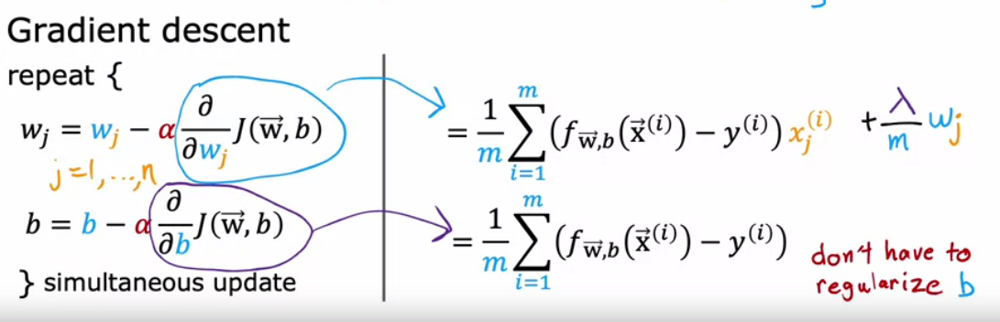

# Overfitting and underfitting
***
## Underfitting
Underfitting is an issue where the parameters are incorrectly tuned - the model does not fit the training data very well. 
Another term for this is a 'biased' model. 

The residual plot on the regression model (residual = actual - predicted). 

The residual plot will have a clear pattern, suggesting that the model has missed a pattern in the data. 


***
## Overfitting
- Overfitting is the exact opposite of underfitting. 
- The model is fitting the data exactly, and in the process becomes very complicated. 
- The model will not *generalise* to unseen example. 
- Another term is a high variance model. 

### Overfitting in regression: 


### Overfitting in classification: 


***
## Correcting over and underfitting: 
1. Increasing ```m```, the number of training examples:
- Getting more data will create a more populated training set and the model will not wiggle around the data points as much. 

2. Do not use too many feautres especially when m is small. 
- Choose the most appropriate features: **feature selection**
- However, this comes with a disadvantage. You are loosing information and may not want to throw away ANY information. 

3. L2 Regularisation for reducing the complexity of the model.
- In regularisation, we penalise the wj parameters with their value. The lesser the weights are, the less complicated and wiggly the model is. 
- There is no need to regularise b, since it often corresponds to an intercept and will make little difference to reduce the complexity of the model. 

***

## Implementing regularisation

To implement regularisation, we add a regularisation term to our cost function and the corresponding partial derivative to the update rules. 
- The regularisation is implemented using these rules:


- While L1 regularisation uses the absolute value, L2 uses the square of the parameter value. 
- L2 is more preferred because it throws more emphasis on larger parameters and is less expensive to implement. 
- Modulus is very expensive to implement. 

- Hence the regulatisation term becomes: 
```n``` is the number of feautres (hence the number of w params).


With L2 regularisation, the derivative term is as follows: 
*Partial derivative with respect to wj*


### Regularisation in linear regression: 



- Note that the only addition is of the derivative term at the end. 

### Regularisation in logistic regression:


- For logisic regression, the cost function will differ, but the calculation with function notation will remain the same. 

