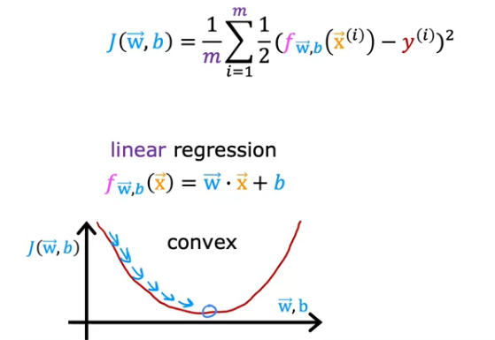

# Supervised learning - Classification
***
In classification, we do not predict an output value from a continuous range. 
We output a discrete value corresponding to a *class* or a *category*

**The classification algorithm is called LOGISTIC regression**.

For example: 
1. Categorising an email as spam/ham (binary classification).
2. Using performance values of a GPU to output the class of performance 
3. Using personal factors to predict the result of a Meyers-brigs test (where there are 2 ^ 4 possible output classes.)
4. Using size, thickness etc. to predict malignancy of a tumor. 

***
## Binary classification 
* In binary classification, we use two output classes. 
* One of them is called positive, one of them is called negative. 
* The choice of positive and negative is arbitrary and depends on the engineer. 

### The math behind logistic regression.
- In classification, we want discrete outputs only. 
- The model is similar to what is used in regression, but it is extended by applying an activation function. 

```z = w dot x + b``` 
```prediction function = sigmoid(z) or g(z)```

#### The sigmoid function 
- The sigmoid function is a mathematical function used to convert continuous outputs to discrete outputs.
- it takes the form g(z) or  σ(z) = 1/(1+ e^-z)


(a) Domain ranges from [-inf, +inf]

(b) Range is from [0, 1] which can help us assign the output to a discrete category. 

##### Interpretation of the sigmoid output: the probability that the input data corresponds to the positive class (or '1' class). 
For example, if z = 0.45, then  σ(z) = 0.61 
    - There is a 61% chance that with the input features we have an output label of one. 
- In other words,  σ(z) = P(y = 1 | w, x, b)

***

### Decision boundaries
- To assign a discrete label to the data, we need to use a _decision boundary_. 
- The decision boundary is a number used to split the sigmoid output into two classes. 
- If  σ(z) >= 0.5, then we might choose class '1', otherwise chose '0'. 

*How does the decision boundary relate to z?* 
Recall that, ```f(x) =  σ(z) =  σ(w dot x + b) ```
- when  f(x) > 0.5, then wx + b >= 0.
- when  f(x) < 0.5, then wx + b < 0 
- Hence on the original function, the y axis is the decision boundary. 
- With respect to the parameters, the space wx + b = 0 is the decision boundary. 
- It might be a planar space (line, curve) or a higher order boundary, depending on the number of input features. 
- If any point lies on or above this boundary, it is classed as 1
- Otherwise, it is classed as 0.

#### Linear decision boundaries - Visuailisation 
* Consider the following model: ```f(x) =  σ(z) =  σ(w1x1 + w2x2 + b)```


In this image, x1 is the x axis and x2 is the y axis. We see a clear decision boundary splitting the two classes. 
The equation of the decision boundary is x2 = (x1/2) + 2.0 
From this, we can decide the weights of the logistic regression model: 

w1x1 + w2x2 + b = 0
w2x2 = -w1x1 - b = (x1/2) + 2.0
*Hence: b = -2.0, w1 = -0.5, and w2 = 1* 

#### NonLinear decision boundaries 
* It is not always the case that a decision boundary between two features is a straight line. It might be a curve. 


*Note: It is important to plot the data with the classes labelled differently using matplotlib or equivalent libraries and decide if linear or nonlinear logistic regression is needed.*
*Then, feature engineering can be used to produce non-linear (polynomial logistic regression).*

**THE PURPOSE OF GRADIENT DESCENT HERE IS TO LEARN THE DECISION BOUNDARY, AND USING A NONLINEAR F(X) WILL LEAD TO FASTER CONVERGENCE AND MORE ACCURATE PREDICTIONS.** 
***
## Training your logistic regression model 
- A lot of ideas for logistic regression have been taken from linear regression, including cost and loss functions. 

- For linear regression, we used a *squared error* cost function.

- However, we cannot use the same cost function in logistic regression. 
- This is becase f(x) =  σ(z) = 1/(1 + e^-(wx + b))
- If we plug this into our cost function, we end up with a nonconvex cost function which is very hard to minimise using gradient descent since there are lots of local minima. 
- Instead, we use a LOG-LOSS FUNCTION. 

### Logarithmic loss function: 
Let  ```f(xi) =  σ(wxi + b)``` for the given ith training example. 
The loss function for that ith training example is piecewise: 


blue: -log(f(xi)) [when yi = 1]
* This choice is good because we want an output close to 1 (greater than or equal to half) in which case the loss is low. If it outputs 1, the loss is exactly 0, but if it outputs 0, the loss approaches infinity. 
* This way the model is 'punished' with a high loss if it outpus a value close to 0 when yi is actually 1.


red: -log(1 - f(xi)) [when yi = 0]
* This choice is also good because we want f(xi) to output a value close to 0 (less than half), in which case the loss is low. If it outputs exactly 0, the loss is 0 as well. But if it outputs 1, the loss approaches infinity. 
* In this way the model is 'punished' with a high loss if it outputs a value close to 1 when yi is actually 0. 

**These choices of cost functions are cleverly chosen to condition the model to learn the decision boundary quickly and accurately.**
***
## Simplified loss function: 


- This is similar to the piecewise function above. You can check by plugging in yi = 1 and 0 and see that the terms cancel out to give the function from above. 
***
## Gradient descent for logistic regression: 
Cost function for logistic regression: 


Parameter updating procedure: 
- This is the same expression as in linear regression. It is found by taking partial derivatives of J with respect to each of the parameters in f(x). 


***
