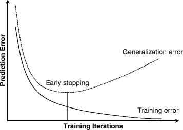

# Supervised learning - Regression
****

Regression is a type of supervised learning where a set of input(s) is used to 
predict an output variable. 
The training dataset contains labels and can optimise the algorithm's parameters. 

****
**Example of UNIVARIATE LINEAR regression:** (where we have one input feature only)


## Procedure for using regression
###Some terminology:

(a) Features (x) is/are the predictor variable/variables in the training set.

(b) Target (y) is the output variable to be predicted. 

In the above case, the predictor is the house size and the target is the price. 

#### Procedure for training the model: 
- The model takes the form f = wx + b. This is the straight line equation. 
- f(x) = wx + b
- The *parameters* of the model are w, b - the slope and intercept. 
- We need to minimise the **cost** function - Which is the average (mean) squared error. 


 - Note that y-hat is the prediction and y-hat minus y is the residual. 
 - We square the residuals to eliminate negatives (and because modulus is expensive). 
 - We divide by 2 to cancel to give a nicer expression on application of chain rule. 
 - Gradient descent/newton's method. can be used to minimise this function. 


- The cost function is a 3D function - J(w, b) and we want to minimise w and b individually using gradient descent.
- The Hessian of the cost function at the minimum value of w and b will contain all negative eigenvales. 
****
###Implementing gradient descent using pandas and numpy
For implementing gradient descent, we need to perform a simultaneous update of w and b. 
```python
# We need to implement multiple functions for gradient descent.
import pandas as pd 
import numpy as np 
import random

df = pd.read_csv("houseData.csv")
arrayOfFeature = df['size'].to_numpy()
arrayOfTarget = df['price'].to_numpy()
m = len(arrayOfFeature)

def calculate_cost(w, b): 
    costFunction = 0
    for (x, y) in zip(arrayOfFeature, arrayOfTarget): 
        costFunction += ((w * x) + b - y)**2
    costFunction = costFunction / (2 * m)
    return costFunction

def partialDerivativeW(w, b): 
    partialDerivatve = 0 
    for(x, y) in zip(arrayOfFeature, arrayOfTarget): 
        partialDerivatve += ((w * x + b) - y) * x
    
    partialDerivatve = partialDerivatve / m
    return partialDerivatve

def partialDerivativeB(w, b):
    partialDerivative = 0
    for (x, y) in zip(arrayOfFeature, arrayOfTarget): 
        partialDerivative += ((w * x + b) - y)
    partialDerivative = partialDerivative / m
    return partialDerivative

   
def adjustParameters(w, b, learningRate=0.01): 
    w_new = w - learningRate*partialDerivativeW(w, b)
    b_new = b - learningRate*partialDerivativeB(w, b)
    return w_new, b_new

def linearRegressionModel(): 
    w = random.random()
    b = 0
    learningRate = 0.1
    previousCost = float('inf')
    
    while True: 
        w, b = adjustParameters(w, b, learningRate)
        currentCost = calculate_cost(w, b)
        
        # Check for convergence - very small difference in cost
        if abs(previousCost - currentCost) < 1e-6: 
            break
        previousCost = currentCost
         
    modelMetrics = {'slope':w, 'intercept':b, 'MSE':calculate_cost(w, b)}
    return modelMetrics
    # Note that sometimes, normalising the data is necessary to prevent numerical instability.

```

# Multivariate linear regression 

In multivariate regression, we have multiple input features to predict one output feature. 
Hence our **model** becomes:

f(w, b)(x) = w1x1 + w2x2 + w3x3 + ... wnxn + b

Parameters of our model: 
1. a vector, *w* = [w1, w2, w3, ... n]
2. a scalar, b 

Hence, our model can be written as follows: 
``f(x) = yhat = *w* dot *x* + b ``
- We vectorise the input feautres and the associated weights into numpy arrays, and then take the dot product using ```np.matmul(), np.dot()``` or with the ```@``` operator. 


- Vectorisation is a much faster implementation because the product comptuations are run in parallel. 

### Implementing multivariate linear regression with gradient descent and vectorisation 
Process: 
1. Store the data in arrays and declare the weights and bias in a vector. 
2. Code a compute cost function
3. Code a calculate derivatives function
4. Code an update parameters function 
5. Integrate all of it in the train() function.

Derivatives to use: 


###[Side note] Normal equation for linear regression: 
- We can use the statistical defenition of linear regression. 
- Calculate the correlation coefficient and use the formula ```r = b * sy/sx``` to find b. 
- Although some machine learning libraries might use this, it is not recommended. 
***
### Feature scaling: 
- Consider the following equation: 
- f(x) = w1 * x1 + w2 * x2 + b 
- x1 -> size of the house in square feet. 
- x2 -> number of rooms of the house. 
- Since x2 tends to be much smaller than x1 numerically, the parameter w1 will be much smaller than w2. 
- Hence, the cost function will be very sensitive to changes in w1 (since w1 multiplies with a large number). 
- The gradient descent algorithm will take lots of time to run because it has to jump back and forth to find the global minimum 
- To correct this, we use feature scaling. 

#### Methods for feature scaling: 
1. Division by maximum 
2. Standardisation using z-scores (x - mean)/sd. 
This procedure is also called normalising. 

**When you use scaling and are making predictions, you must scale down all the input values and then de-scale the output values.**
(The mean and sd of each feature in the training data must be stored.)
***

### Feature engineering:
Feature engineering is when you use your intuition and knowledge of the field to which machine learning is applied, and use the input features 
to calcualate an 'engineered' feature by transforming or combining the input features. 

For example: f(x) = w1 * width + w2 * length + b 
In this case, if f(x) predicts the price of a house, a useful engineered feature would be the area, length * width. 
f(x) = w1 * width + w2 * length + w3 * area + b

## Polynomial regression using feature engineering:
- Sometimes, features are engineered to square, cube etc. 
- Then, the predicting line is not straight. It is a curve. 
For example: 
f(x) = w1 * x1 + w2 * x2 + w3 * x3 + b
- It might be useful to square all values of feautre 2 and use this to predict. 
- f(x) = w1x1 + w2x2 + w3x3 + w4(x2)^2 + b

* Note: It is very important to scale features when engineering them using polynomial regression, since the ranges of (xi)^n and (xi)^(n+k) will be vastly different. 
* This also necessitates extra work in the prediction module to scale and descale. 


***
## Learning curves and choosing a learning rate 
A Learning curve is a plot of the cost function against number of iterations of gradient descent peformed. 
- A learning curve can provide a lot of information about our chosen learning rate. 

1. A learning curve that shows an increasing trend indicates a very high learning rate. 
   - This is because the adjustment overshoots the minimum and goes to the other side. 
   - Hence the learning rate has to be decreased. 

2. A learning curve that shows a decreasing trend which is very slow indicates a low learning rate. 
     - For faster convergence, the learning rate should be increased by some factor. 
   
#### Test for convergence 
**Automatic test**: Check if the difference in cost is very low, usually < 1e-6, or ```float('-inf')```



```
# Code for multiple (multivariate) linear regression
- Check the repository to find 'Multivariate linear regression.py'
- Play around with the learning rate and see what happens!
```

