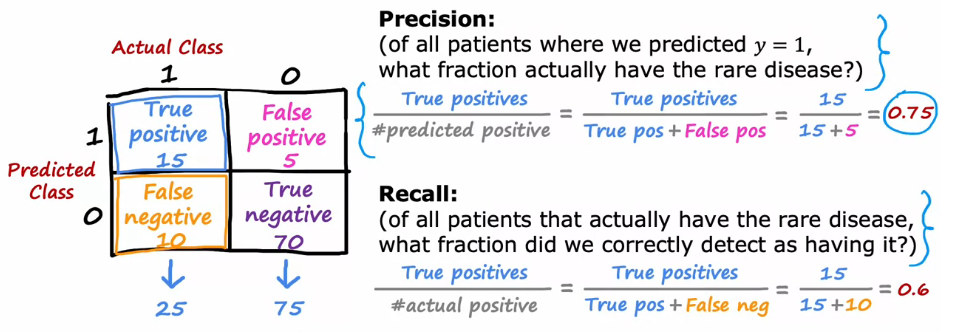
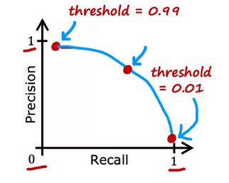

# Advice for implementing machine learning
***
**Throughout the industry, machine learning practioners use many techniques to optimise unmpteen aspects of deploying a machine learning model.**
In this section some of those aspects will be discussed. 
## Contents: 
1. Validating a machine learning model
2. Bias and Variance 
3. Machine learning development process
4. Skewed datasets 

***

## Evaluating a machine learning model

#### Systematic ways are required to evaluate the performance of a machine learning model that do not rely on plotting and visual inspection. 

### Splitting of dataset

- First, minimise the cost by using the loss function and the regularisation term. 

- When we evaluate a model, we must not only rely on a training error (MSE) because an overfit model will have a very low training error. 
- We must find the generelisation error, which is the MSE computed on a test set. 
- The generalisation error is the more accurate estimate on the performance of the model outside the training set. 
- We can use this to choose a model. 

```Example: 
Goal: Predict housing price, y from the size of the house, x. 
Possible models: 
d = 1: f(x) = wx + b 
d = 2: f(x) = w1x + w2x^2 + b 
....
d = 10: f(x) = w1x + w2 x^2 + .... w10 x^10```
```

### How to split the dataset? 
1. Training set - Larger portion of the data, eg: 60%
2. Testing set - Smaller portion of data, eg: 20%
3. Cross-Validation (dev) set - Smaller portion of data, eg: 20%


- We can use suitable subscripts on ```m``` to denote the elements belonging to each set. 

### How to use these sets? 
1. First, minimise the parameters 
2. Then, compute the training error on the training set. 
3. Then, compute the _cross-validation_ error. 
4. Then, compute the test set error. 
- All of these are mean squared errors but without the regularisation term.


Then, to choose a model from the above block:
(a) Run all the models and compute the cross validation error for all of them.
(b) Pick out the model with the lowest cross validation error.
(c) Then, for that model, report the following: 
    - Training error
    - Generalisation error (from the test set)

- We are choosing the model based on the cross validation error, because if we did it with test error, then it will report an overly optimistic estimate of the performance of the model on unseen data. 

### Using the process in classification algorithms: 
1. Minimise the w and b parameters using the cross entropy loss (logarithmic loss) function. 
2. Do it for all of the models in the code block with the activation function and decision boundary. 

#### Computing errors: 
In classification, the errors are the fraction of the data that are misclassified, not the log loss error that is reported. 
1. Training error - Number of misclassified training examples/mtrain 
2. Cross validation error - Number of misclassified dev examples/mcv
3. Testing error - Number of misclassified test examples/mtest
- Where m sub k is the number of examples in the k set. 

Then again, choose the model using the lowest cross validation error, but report the test error as the generalisation error for the model. 

#### We can also use this model to select neural networks using tensorflow. 
- Run the code to train and fit the neural network as usual. 
- Use model.predict on the cross validation set for all architectures. 
- Pick the architecture with the lowest cross validation error. 
- Then report the testing error as the generalisation. 

**IMPORTANT: It is advised to stick to mean squared error for regression and the fraction of misclassified examples for the testing example.**

***
## Diagnosing bias and variance in machine learning
What is a diagnostic? 
- A diagnostic is a process to evaluate the performance of a machine learning model to see what is/isn't working properly. 

### Bias and variance

- In a high bias (underfit model): 
    - Jtrain is high 
    - Jcv is high 
- In a high variance model (overfit): 
    - Jtrain is low 
    - Jcv is high
- In a good model: 
    - Jtrain is low 
    - Jcv is also low

  

- Underfit is to the left. Overfit is to the right. Just right is in the middle. 
- Usually, the cross validation error is higher than the training error in either case. 

- When a model has both high bias and high variance
    - Jtrain will be high 
    - Jcv will be much much higher (Jcv >> Jtrain)
- This will occur when the model underfits part of the set and overfits the rest. 

### Regularisation and its effects
Example: 
- Consider a fourth order model: f(x) = w1 x + w2 x^2 = w3 x^3 + w4 x^4
- The cost is the regularised mean squared error. 

- We can use cross validation to choose a good value for lambda. 
- Just like how we chose a model based on the degree:
```
1. λ = 0 - Compute Jcv
2. λ = 0.01 - Compute Jcv
3. λ = 0.02 - Compute Jcv
....
12. λ = 10 - Compute Jcv
```
- Choose the model with the least Jcv. 
- Report the test error, Jtest as the generalisation error. (MSE [Regression], Fraction of misclassified examples [Classification])

    - To the left, lambda is small and the model overfits. Hence although it has a low error on the training set, it has a very high error on the cross validation set. 
    - To the right, lambda is large and the model underfits. Hence, it has a high training error and an even higher cross validation error. 

### Establishing a baseline level of performance 
- Often times we use human error, error from another trained model, or by guessing it using experience in the field. 
- This is a baseline error. 
  - If the baseline error is not close to the training error, then we have a high bias problem. 
  - If the training error is much less than the cross validation error, we have a high variance problem. 
  - Quantitatively, we can have both problems. 


### Learning curves 
- A learning curve the cost/error plotted with the experience that the model has. 
- For example:


- It might be no surpise that Jcv decreases with mTrain because the more the training examples, the less the model overfits (it can learn better). 
- However, when mtrain increases, Jtrain increases as well because it is more difficult to fit the same model to a larger set because of random noise. 
- Hence there will be more error and Jtrain will be higher. 
- Jcv will typically be higher than Jtrain because the parameters are fit to the training set and they will be expected to do better on the training set.

### Deciding what to try next 
Some examples of common remedies to machine learning model problems: 
- If a model makes unacceptably large errors in predictions, 
1. Get more training features (For high variance)
2. Smaller sets of features (For high variance)
3. Additional features (For high bias)
4. Adding Polynomial features (For high bias)
5. Decreasing lambda (high bias) - Removes limits on weights and encourages a more complex model that fits the data better.
6. Increasing lambda (high variance) - Limits the weights and the complexity of the model

***
## Neural networks and bias/variance problems

- The bias variance tradeoff with decree of polynomial and regularisation polynomial. 
- The less complex your model (the larger the lambda) you have high bias.
- The more complex your model (the lesser the lambda) you have high variance.
- You have to balance the complexity by picking a middle ground, where cross validation error is lower. 


### How do neural networks help us here? 
- Large neural networks are low bias machines - this is a property inherent to the structure of the model. 
- This eliminates the need for finding a middle ground as follows. 


- However, we cannot use this cycle aimlessely, because we have a finite set of computational power and data to collect. 
- Usually, with a larger neural network, when regularisation is chosen properly the risk of overfitting is very less - this is why thhe entire process appears.

```python
# Regularisation on a neural network
from keras.layers import Dense
from keras.models import Sequential 
from keras.regularizers import L2

layer1 = Dense(units=25, activation='relu', kernel_regularizer=L2(0.01))
layer2 = Dense(units=15, activation='relu', kernel_regularizer=L2(0.01))
layer3 = Dense(units=1, activation='sigmoid', kernel_regularizer=L2(0.01))
model = Sequential([layer1, layer2, layer3])
```

## Iterative loop of ML development 


- First, you choose a model according to your objective. 
- Eg: If I want to use image data to find out if a crop is diseased or not, I might use binary classification. 
- If I want to predict house prices from their size and number of rooms, I might use regression.
- If I want to classify fruits based on their images, I might want to use multi-class classification.

- Second, write code to train the model. 

- Then, use ideas of bias, variance, and error analysis to identify what needs to be done to fine tune the model 
- Often this part takes months of work (more than building the model took). 

### Error analysis: 
Example: Suppose you have mcv = 500 cross validation examples, and the algorithm misclassifies 100 of them. 
- Error analysis involves going through these misclassifications and grouping the erros into themes.

- Suppose in the 100 of them, the spam classification algorithm misclassifies these:
1. Pharma - 21 
2. Deliberate misspellings - 30 
3. Unusual email routing - 40 
4. Phising emails - 4
5. Spam message emedded in the image - 5

- These categories are not mutually exclusive. You can have overlaps. In that case, one email will be counted in multiple categories.
- Categorising these emails is helpful because you can include more data in specific categories, which might again help an overfitting problem. 
- You might also find that some errors are not worth solving because they are so minor. 
- However, error analysis is not always easy. For tasks that humans cannot do on their own (eg: predicting which ads people will click on.)

### Principles of adding data
(a) Don't add everything under the sun in case of an overfit. Choose wisely: 
    - Use the error analysis process to find classes that the algoritm misclassifies.
    - it leads to a modest cost, unlike when you fish for data from everywhere. 

(b) Data augmentation
We can use the training example and transform it geometrically:
    - Example: If you are training a softmax classifier to classify letters, you might take examples and rotate them a bit, reflect them, englarge them etc. 
    - We can use gridded images and use distortions to make the algorithm more robust.
    - Example: In case of an audio example, we can add background data to our training data. 

- **Whenever we do data augmentation, we must do it on the entire data, including the test set. This will give an accurate measure of the performance of an algorithm because that is what the learning algorithm ultimately will look at. 

(c) Data synthesis
- Sometimes, we can write code and generate data that looks real. 
    - Example: For computer vision and OCR tasks, we can use a computer notepad and type out text in different font and color, then screenshot it to add it to our training set. 
  

- In today's times, it is better to use a data centric approach, where both data and the model are focussed on, instead of the conventional approach where the model is the main focus. 

### Transfer learning for neural networks.
- Sometimes, a speciality will have very less data, and adding more data is not an option. 
- In this case, we apply *transfer learning*. 

Process of transfer learning: 


1. Supervised pretraining
- We use parameters from another algorithm that may have something common with your application. 
- This is because the layers from the pretrained model on the related application will have layers that are tuned to predict things useful in your application. 
- Note: The input type has to be the same. If my application is classification, then the pretraining algorithm is also classification of the same kind (binary/softmax/multilabel)

2. Fine tuning
- The parameters from the pretrained model are either downloaded or trained on your system. 
- Then, there are two options:
  (a) In the case that we have a lot of data for **our application** we can start with the downloaded parameters and run gradient descent on our data to fine tune our parameters.
  (b) In the case that our dataset is not too vast, we can remove the output layer and reinstate it by training it with our data. The rest of the layers are left untouched.

Example: 
- Suppose that I want to build a model to classify handwritten digits, but I do not have enough data. I only have mtrain = 50. 
- Somebody else has a vast training set they used to build a self driving car's multilabel image classifier. This predicts outputs from 1000 classes. 
- I can use the pretrained model's parameters for digit classification because the input type is the same, and the initial layers in the pretrained neural network do essentially the same things as in my application. (Detecting edges, curves, corners, etc.)
- I can run my algorithm on the output layer (because the dimensions are different). 


***
## Summary - Full cycle of a machine learning project. 

### Machine learning operations 
- MLOps is the study of building, deploying and efficiently maintaining machine learning models. 
- Depending on the number of people who will use the model, it will require some amount of software engineering: 
    1. Scaling 
    2. Data logging
    3. System monitoring (allows us to update the model as and when needed to cater to changing user inputs). 
    4. Ensuring reliable and efficient production. 
- Mostly, there will be a software deployment team that takes the built model and deploys it onto servers, creating API endpoints and linking them to the user endpoint. 

### Fairness, Bias and ethics
- In some cases, software is used in unethical practices such as impersonation and fraud. 
- There are also concerns about racism/sexualism/ethinictism. 

#### Fixing these issues 
1. Brainstorm all possible things that can go wrong; emphasize on the groups that are particularly vulnerable. 
2. Carry out a literature search on standards/guidelines for our industry. 
3. Audit the machine learning model before it goes into deployment. 

***
## Error analysis - Skewed metrics 
- Example: if you are training a Binary classifier to predict a rare neurological disease. Only 0.5% of the populace has it. 
- You can have the following predictions: 
  - A machine learning model which has 1% error on the cross validation set. 
  - A simple print statement that prints y = 0 with a 0.5% error. 
  - We know that the second model is ofcourse less accurate, but this must suggest that our tranditional metric does not work. 
  - We use precision and recall as error metrics here. 
  
```
precision = the fraction of positive predictions whose class is actually 1
recall = the fraction of actual positives which were predicted as positive. 
```


#### Optimal point between precision and recall
- Raising the boundary threshold will lead to a higher precision but a lower recall. 
- Lower the boundary threshold will lead to a lower precision but a higher recall. 
- Balancing precision and recall pertains to the target problem: 
  - If the disease is very rare, the treatment is very evasive and if left untreated the disease is not too problematic, then we might want to go with option one. 
  - if the treatment is mild but leaving the disease can cause serious implications we might want to predict one more easily. 



#### F1 score - automatically trading off precision and recall. 
- The F1 score is the harmonic mean of precision and recall. 
F1 score = 2PR/(P + R) and will help find a balance between precision and recall. 
