# Decision tree models 
***
## Decision trees for Binary classification 
### Using boolean features 
- A decision tree is a machine learning model used for machine learning tasks. 
- In the case of a boolean binary classifier, it looks like a dichotomous key.

***Terminiolgy in decision trees:***
1. Root nodes: The top most node that segeregates the example based on the first feature. 
2. Decision nodes: The ovals further down the tree that decide whether to go left or right. 
3. Leaf nodes: Used to make a prediction. The square boxes in this case. 

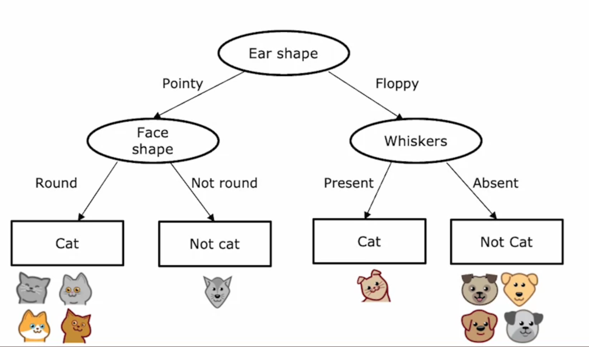

- If a cat has a Pointy ear and a round shape it is a cat. 
- If a cat has floppy ears and whiskers, it is a cat. 

- The structure of the decision tree will influence the training, dev and test error. 
- Just like how we minimise parameters, we find an optimal structure for a decision tree to make good predictions. 

***
## Training/Learning a decision tree 
We need to make some *key* decisions when building a decision tree:
: 
1. How to choose which features to split on at each node? (to maximise purity - the leaf node has all a single ground truth label)

For example, if we split by cat DNA, we get a pure split. Using other features will give different purity. 
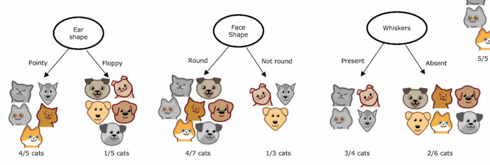
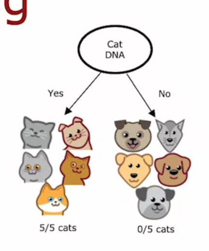

2. When do you stop splitting?
We use two methods:
   (a) When a node splits the examples into pure classes (eg cats and not cats)
   (b) When splitting it will result in the tree exceeding maximum depth.
   (The depth is the number of hops required to get to that node)
   (c) When improvements in the purity score are below a threshold and splitting it further to get 100% purity is not beneficial.
   (d) If the number of examples at a node is below a threshold. 

### Using quantitative methods to choose decision trees
- Let ```p1``` be the fraction of examples that are cats.
- Let ```p0``` be the fraction of examples that a not cats.
- H(p1), information entropy, is used to measure purity and impurity.
- Example: if p1 is 0.5, H(p1) is 1. 
- If p1 is 5/6, H(p1) is 0.65. 
- If p1 is 6/6 (1), H(p1) is 0. 
- Using information entropy is a useful way of validating a split. 

Definition of information entropy: ```H(p1) = -p1log(p1) - p0log(p0)```
```p0 = 1 - p1```
- Note that by convention we use log base 2 so that the peak is 1. Other bases can be used as well. 
- When p1 or p0 is either 1 or 0, it results in an undefined calculation, but we consider 0log(0) to be 0 for computational purposes. 

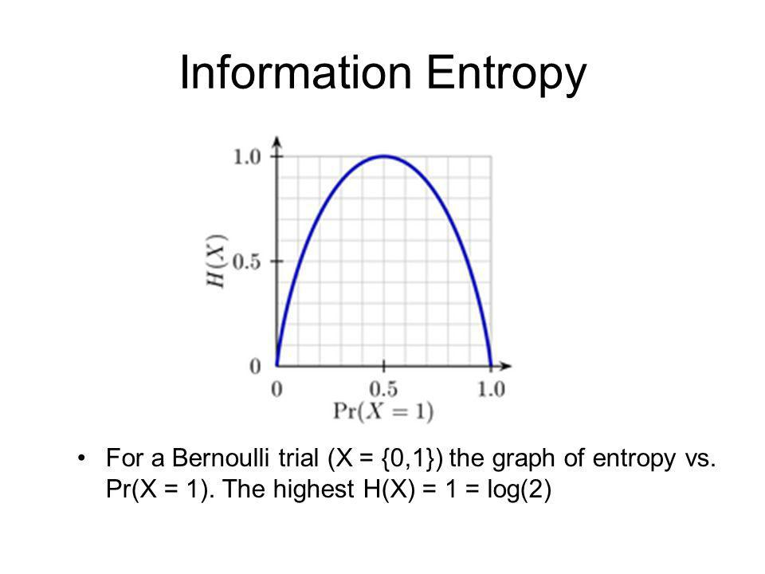

### Infromation gain and choosing a split 
- For each possible split, we evaluate the entropy on the left and right branch and take the weighted average entropy based on the number of examples at each branch to take the fact that the size influences entropy. 
- Then, we compute the reduction in entropy from the previous node, which gives us the information gain.

Example: 

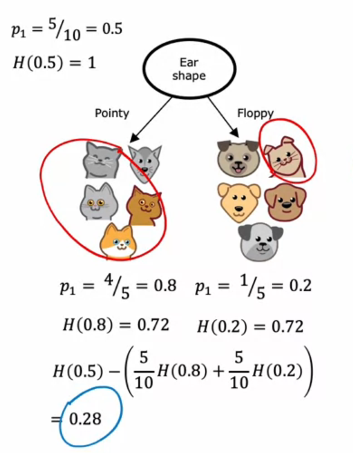
- Let p1 k be the fraction of positive examples at the k branch. 
- Let p0 k be the fraction of negative examples at the k branch. 
- Let w k be the fraction of examples that went to the k branch. 
- Here, k is left or right. Root refers to the root node (or the previous node). 
- Information gain is calculated using this expression: 
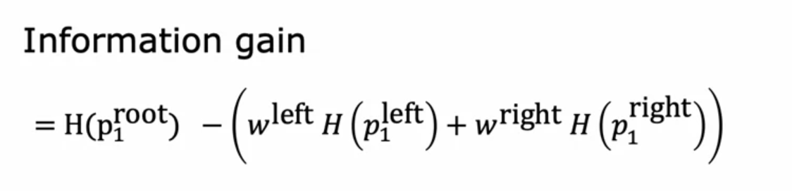

### Putting it together to build a large decision tree: Recursive splitting 
- We decide what to split on from the root node by computing information gain. 
- Then, we have left and right sub branches. 
- In the left sub branches, we again choose the feature that causes the highest recursion gain. 
- We continue this for all the sub branches until the criteria for stopping is met. 

***
### Decision trees with non boolean (multiple) classes in features 
- One hot encoding is used to convert a feature with multiple classes into boolean features. 
- For example, if I have 3 classes for ear shape:
- (a) Pointy ears 
- (b) Oval ears 
- (c) Floppy ears
- We can create 3 binary value features: (1) Does it have pointy ears? (2) Does it have Oval ears? (3) Does it have floppy ears? 
- We can also use one hot encoding to transform inputs and make them suitable for neural networks and logistic regression.

### Decision trees with continuous valued features 
- We can include continuous features (eg: the weight of a cat) we can find the information gain when splitting on that feature with all possible boundaries. 
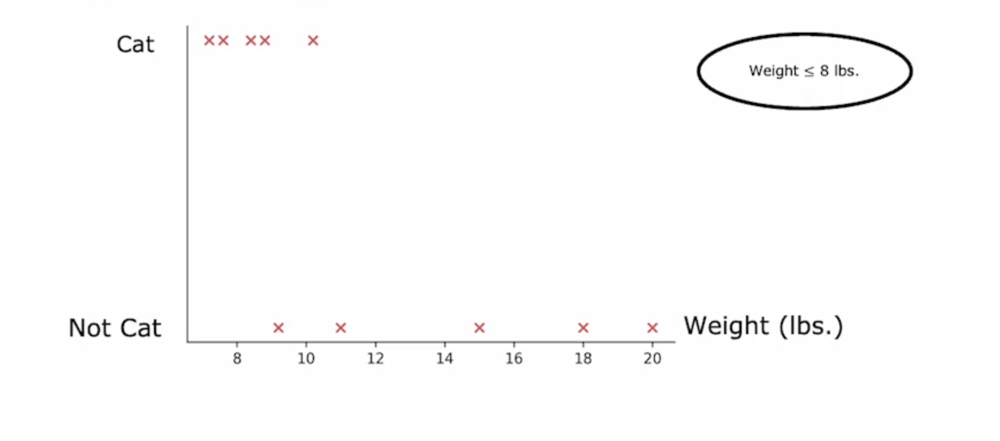
- We can calculate the infromation gain with the boundary passed in as an additional parameter. 
- If any possible boundary results in an information gain higher than splitting with any other feature, we will choose that threshold. 

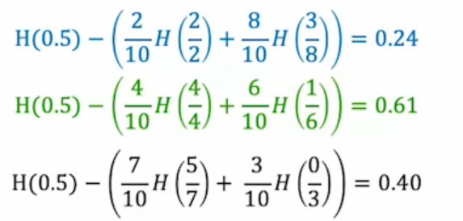
- Blue: Boundary = 8 lbs.
- Green: Boundary = 9 lbs. 
- Black: Boundary = 10 lbs. 
- In this case, 9 lbs proeduces a threshold higher than any other feature. 
- This is going to be our first split. 
- Then, the next splits can be found using recursive splitting and calculating the information gain at each stage. 

***
## Regression trees 
- A regression tree is a decision tree meant to output a continuous valued function. 

(a) Making prediction: 
- Once the tree is constructed based on the features (which can be categorical or continuous), we will make predictions using the ARITHMETIC MEAN of the examples at each leaf node. 
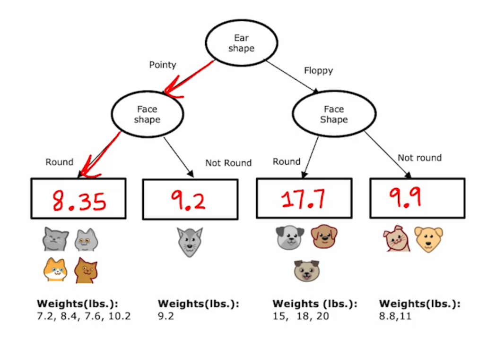

(b) Choosing the split: 
- When we were using classification, we calculated the information gain and recursively chose splitting. 
- For regression, we use the reduction in **variance** to choose a feature to split. 
- If a continuous valued feature is present, we will check if any boundary for that feature used as a split will generate a reduction in variance more than any other feature. 

```Reduction in variance = Variance at previous node - weighted average variance at current node```

```Weighted average = (wleft * varleft) + (wright * var-right)```
Where w super k is the fraction of examples that go to the kth side. 
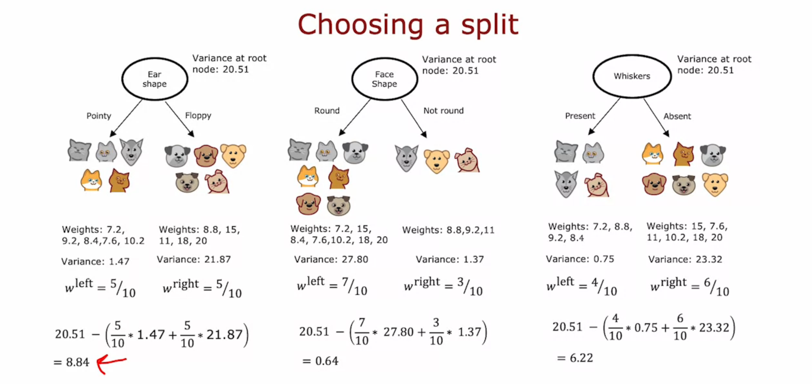

***
## Tree ensembles 
- Individual decision trees are very sensitive to small changes in the data. 
- If a single example is changed, the entire tree has to be rebuilt. This is very expensive. 

- With an ensemble, multiple trees will make decisions and the majority decision will be chosen as the final prediction. 

### Constructing decision trees using sampling
Key points used to define random forest algorithms: 
1. We will randomly sample with replacement from our training set and construct d decision trees out of those. 
2. Sometimes, when n is very large, we might restrict the features that go to each tree. 
A general rule of thumb: k, the number of features to go to each tree = floor(sqrt(n)) for large n. n > k.
      - k features are chosen at random from the n features and are used to train each tree as usual. 
      - For small n, we might just pass all the features into all the trees. 

### XGBoost 
- Boosting uses the same model as a bagged random forest, but it does not randomly sample from the original training pool. 
- It looks at the previously built tree and the predictions it makes. it idenfities all the wrong predictions from that tree. 
- For the second tree, there will be a higher probability of picking the examples misclassified in the previous trees and trains on them. 
- XGBoost assigns weights to each training examples and updates them based on how they were classified previously. This manifests itself in training further decision trees. 

```python
# Classification task using boosted decision trees
from xgboost import XGBClassifier
model = XGBClassifier()
model.fit(X, Y)
y_pred = model.predict(X_pred)

```

```python
# Regression tasks using boosted decision trees 
from xgboost import XGBRegressor
model = XGBRegressor()
model.fit(X, Y)
Y = model.predict(X_pred)
```
***
## Choosing an appropriate advanced learning algorithm: 

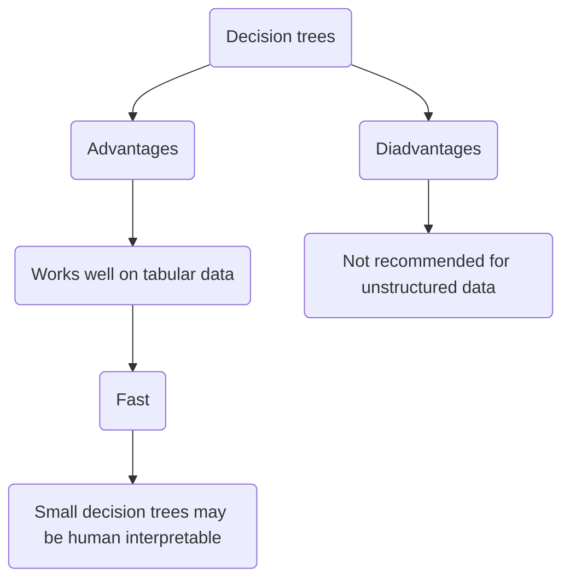

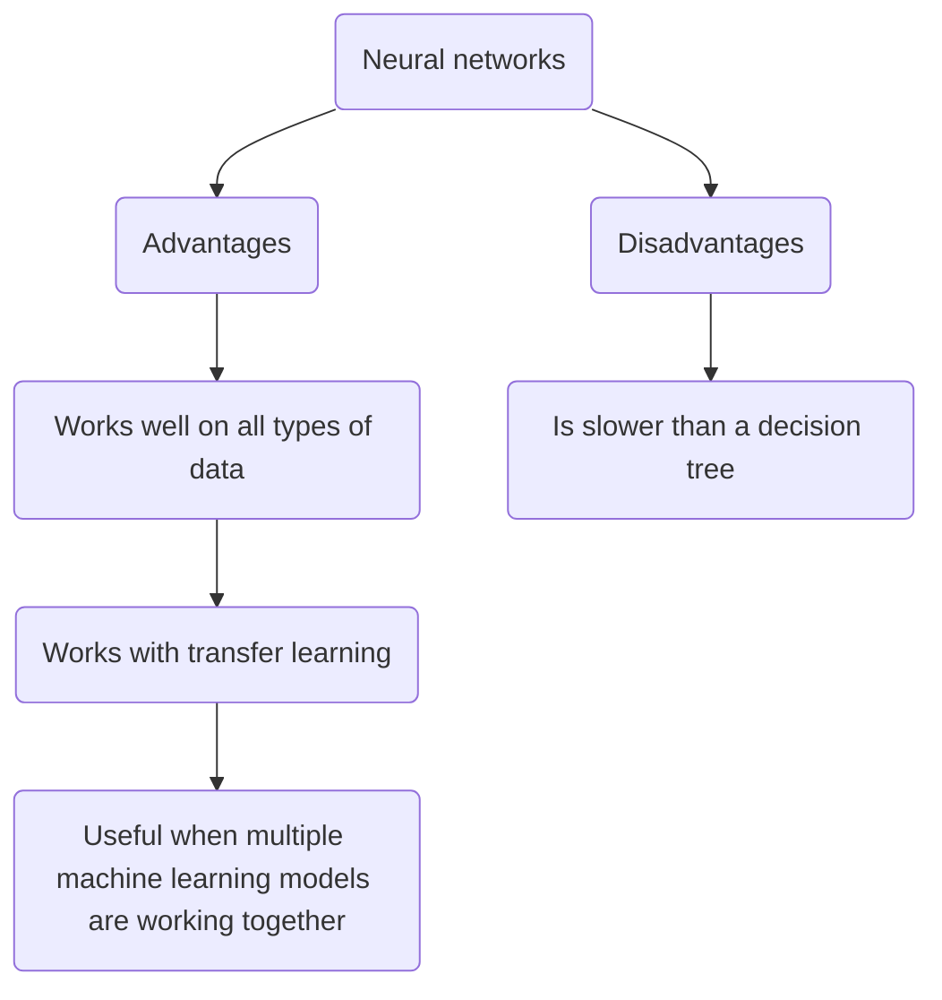