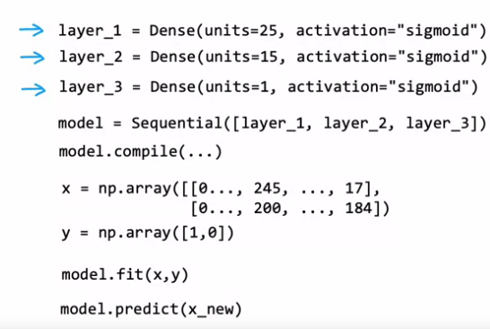
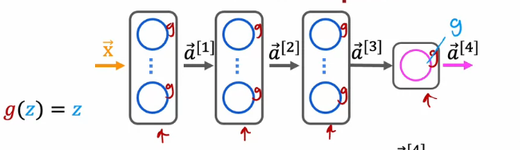
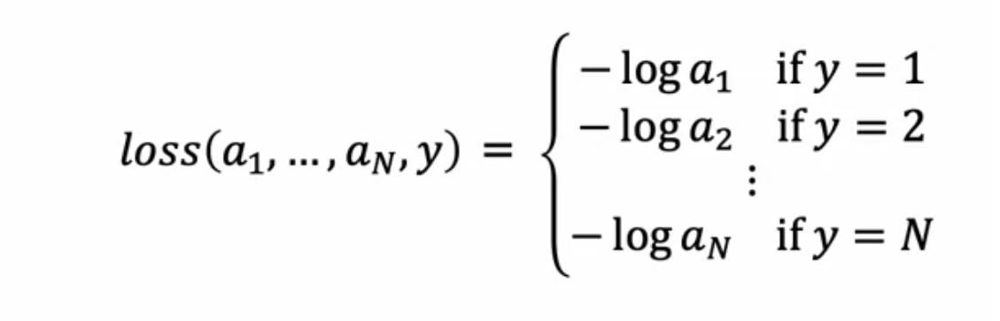

# Neural networks 
***
## What is a neural network?: 
In the dawn of the machine learning era, we have taken inspiration from biology and have built *artificial neural networks*. 

### Diagram of a neuron


- Each neuron has a set of inputs through its dendrites. 
- The cell body processes these signals (the cell organelles within the cell body) and produces an output. 
- The output is sent out through an axon to another neuron, which again will have multiple inputs. 

- Similarly, in neural networks, each **perceptron** (artificial neuron) takes in a set of inputs and outputs a value to another set of neurons. 

#### Neural networks are popularly used for NLP, speech recognition and computer vision. 
- This is because of their high learning capability when compared to traditional AI and supervised learning models. 

    - The rate at which a neural network learns increases faster than any other model with the size of the training set being a scale factor. 
    - The performance further improves with larger and larger neural networks, with more layers. 

### High level mechanics of a neural network. 
- A perceptron takes in inputs from other neurons and assigns weights to them. 
- ```w = [w11, w12, w13....]```
- Additionally, it will also take in a b value, which is a scalar but will be broadcast to a vector as needed.
- Then, each unit performs logistic regression and gives an output to the next perceptron. 
- This output is called the activation, a = sigmoid(z) = a/(a + e^-(wx+b))
- The model is collectively trained to minimise the loss function and all the weights for each neuron are analyser. 


#### Exampole: Demand prediction in a neural network.
Terminology: 
1. Input layer - The set of features passed into a neural newtwork. 
    - Note that all the inputs will be given to all the neurons in the first layer. 
    - In large neural networks with this method, eventually the parameters will be tuned such that each neuron produces an output corresponding to a feature engineered from the original dataset. 


**Example:** In this case, price, shipping cost, marketing, material, all are passed to every neuron in the first _hidden_ layer.
- Eventually the learning algorithm will have its parameters tuned in such a way that: 
     - First neuron produces affordability (price + shipping cost)
     - Second neuron produces awaremess (marketing)
     - Third neuron procuces percieved quality, which is a combination of price + material. 
  
## Layers in neural networks 
- To represent any particular neuron in a neural network we will attach it with a super and sub script.
  (a) Subscript - The row number of the neuron in that particular layer.
  (b) Superscript in square brackets: To denote which later it belongs to. 

For example, the layer recieving the inputs from the input layer are is layer 1 so all the weights, biases, activations will have superscript 1. 
The output layer in a two layer neural network will output a superscript 2. 


- The final output a2 will be used to provide a binary prediction using a decision boundary (usually 0.5).
- With this, more complex neural networks with multiple hidden layers can be built. 

- With this formula, we might use the features from the input layers as a superscipt 0 so it works for the first layer. 

## Forward propogration (inference in a neural network)
- Forward propogation is the process of going from input features to the output of a neural network. 
- The result of each calculation propogates into the next layer as a vector. 
- Eventually, a single scalar value comes out of the output layer, which is mapped to a discrete value. 

## Tensorflow and inference in code
Example: Two parameters that can be controlled when we are roasting coffee are (a) the temperature and (b) time. 
You are given a dataset with the temperature and roasting time, and whether the coffee is roasted or not. 
- Use a neural network to train a classifier that can predict whether coffee will be trained or not based on the time and temperature of roasting. 

```commandline
py -m pip install tensorflow
```
```python
# The input vector is set to an array, 
# Each layer is of a class 'dense' which takes init params units and activation function. 
import tensorflow
import numpy as np
layer1 = tensorflow.Dense(units=3, activation='sigmoid')
layer2 = tensorflow.Dense(units=1, activation='sigmoid')
# Note - this is just for demonstation, the code is not the exact same. 
# Check the source code in working dir for reference. 
a0 = np.array([[200, 17]], dtype='float64')
a1 = layer1(a0)
a2 = layer2(a1)
if a2>= 0.5:
    print('Coffee is likely to be roasted properly')
else: 
    print('Coffee is likely to not be roasted properly.')

```

### Data in tensorflow 
- When we pass our feature vector into the tensorflow model, it has to be of a matrix format. 

```python
import numpy as np
a0_correct = np.array([[200, 17.0]]) # Shape (1, 2)
a0_wrong = np.array([200, 17.0]) # Shape (2, )
# Or you can take a0_wrong and reshape to (1, -1).
# a0_correct = a0_wrong.reshape(1, -1)

```
- Note that when the activation vectors are produced, they are of type 'Tensor', not 'ndarray'. 
- For example if we pass a0_correct into a tensor it will result in Tensor(a = [ ], shape = (), type=...)
- You need to convert it into a numpy array using ```a1.numpy(self)```


### Quicker implementation in tensorflow. 
- We can use the ```sequential``` framework and use methods to train and fit the model. 
Steps:
  (a) Define layers of class dense
  (b) Use the sequential method to string the layers together.
  (c) Define the features with the above guidelines and the targets as a single dimensional array of shape (m, )
  (d) Compile the model
  (e) Fit the model with the x and y values
  (f) Use model.predict.


### General implementation of forward propogation from scratch on python. 
#### Although we can use libraries to automatically build neural networks, it is good to know the implementation from scratch since it can help with debugging. 
```python
import numpy as np 
def sigmoid(x): 
    return 1/(1 + np.exp(x))
# Dataset - Has 1 row and 2 columns (which means that it has 2 features and one example only.)
x = np.array([1, 2]).reshape(1, -1) # Goes from shape (2, ) to (1, 2)
# Layer 1 - Has 3 neurons, so we need to define a weights matrix (2, 3) and bias (1, 3)
# SHAPE OF WEIGHTS MATRIX -> (NUMBER OF FEAUTRES FROM PREVIOUS LAYER, NUMBER OF NEURONS IN CURRENT LAYER)
# SHAPE OF BIAS MATRIX -> (1, NUMBER OF NEURONS IN THE CURRENT LAYER) [more commonly 1 is m, number of examples]
# SHAPE OF ACTIVATION MATRIX (1, NUMBER OF NEURONS IN THE CURRENT LAYER) [more generally 1 is m again]
# Calculation - np.matmul(x, W) is multiplying a (1, 2) matrix with a (2, 3) matrix so the result is a (1, 3) matrix. 
# Bias is a (1, 3) matrix so adding it to the (1, 3) matrix from the previous step results in z (1, 3) 
# Pass into the sigmoid function to get a matrix of activations of shape (1, 3). 

# Layer 2 - Has one neuron only, but 3 features from the previous layer so 
# define a weights matrix of shape (3, 1) and a bias matrix of shape (1, 1)
# resulting matrix is (1, 1) and hence it is a scalar which is activated using sigmoid and then output.


W1 = np.array([[1, 2], [3, 4], [5, 6]]).reshape(-1, -1)
b1 = np.array([1, 2, 3]).reshape(1, -1)
W2 = np.array([1, 2, 3]).reshape(-1, 1)
b2 = np.array([69]).reshape(1, 1) # Converts into a (1, 1) matrix for vectorised operations.
# In fact, we don't have to do this. b2 will be broadcast to the correct shape for error-free matrix multiplication.

a1 = sigmoid(np.matmul(x, W1) + b1)
a2 = sigmoid(np.matmul(a1, W2) + b2)
if a2 > 0.5: 
    print("TRUE")
else: 
    print("FALSE")
```

- Hence, we have a few important things to remember about shapes of weights and biases in the neural network layers: 
    - Shape of weights matrix (NUMBER OF FEATURES FROM PREVIOUS LAYER, NUMBER OF NEURONS IN CURRENT LAYER)
    - Shape of bias matrix (M, NUMBER OF NEURONS IN CURRENT LAYER)'
    - Shape of activation matrix is the same as the shape of bias matrix. 
    - This is because when you do np.matmul(x, W) -> (M, NUMBER OF FEATURES) @ ((NUMBER OF FEATURES FROM PREVIOUS LAYER, NUMBER OF NEURONS IN CURRENT LAYER))
    - This results in a matrix of (M, NUMBER OF NEURONS IN CURRENT LAYER) which matches the bias.
    - If there is a single neuron the bias can be declared as a scalar and will be correctly broadcast to the required shape. 

-When we are defining a neural network from scratch with a lot of layers and neurons per layer, it is important to go through the matrix multiplcation computations and the shapes of the weights and bias matrix for each layer. 
- This can be done because a sane person would only implement neural network from scratch when it does not have too many layers or neurons per layer. 
- Otherwise, tensorflow will do all of this for you. 

## Artificial general intelligence
### What is artificial general intelligence? 
- We have AI systems that are ANI (artificial narrow intelligence), which means they to tasks better than humans in some applications. 
- For example: Self driving, farming practices, factories. 
- Then we have AGI (artificial general intelligence), which means that they many/all tasks as good as or better than humans. 

##### There has been tremendous progres in ANI, but not in AGI 
- This is because a logistic regression neuron is doing nothing close to what the human brain is. 
- if any advances in human brain science come by, and we are able to implement this on computer, we might be able to 
develop artificial neural networks that might be capable of AGI.
- Experiments have been done through the late 1990s on animals and humans to show that brain tissue adapts to the inputs fed into it. 
- For example, the auditory cortex can learn to 'see' things. 
- This further goes to show how our simple artificial neural networks doing logistic regression are nothing like the human brain. 

***
## Backward propogation and model training
```python
import tensorflow
import numpy as np
X= np.array([[1, 2, 3], [4,5, 6], [7, 8, 9]]) # Shape -> (3, 3)
Y = np.array([1, 0, 1]) # shape (3, )
Y = Y.reshape(-1, -1)

m = len(X)
n = len(X[0])

from keras.models import Sequential
from keras.layers import Dense 
model = Sequential([Dense(units=25, activation='sigmoid'), 
                    Dense(units=15, activation='sigmoid'), 
                    Dense(units=1, activation='sigmoid')])
# Compile with binary cross entropy (log loss) function. 

from keras.losses import *
model.compile(loss=BinaryCrossentropy)
model.fit(X, Y, ephocs=1000) # ephocs is the number of times the model is repeatedly trained. 
```
### Steps to train the neural network
1. Specify how to compute the output from the input (forward propogration).
  - In our case, that was f(x) = sigmoid(w x + b)
2. Specify the lost and coss function 
  - The loss function is logarithmic loss, binary cross entropy. 
  - The cost is the average of the loss functions over all the training examples. 
  - This is also called logistic coss/logistic loss.


3. Use a minimising algorithm to minimise the cost and update the parameters. 
  - We used gradient descent to do this. 
  - ```wn = wn - alpha * dj/dwn```
  - ```b = b - alpha * dj/db```

### Mapping these steps to tensorflow 
Step 1: Specifying the neural network architecture - this will tell tensorflow how to compute the output using all the parameters. 
The parameters are defined with the same rules discussed above (vectorisation and matrix dimensions). 
Each layer will have two parameters: W, B. -> W is of form (NUMBER OF FEATURES FROM PREVIOUS LAYER, NUMBER OF NEURONS IN CURRENT LAYER), b is of the form -> (NUMBER OF EXAMPLES, NUMBER OF NEURONS IN THE CURRENT LAYER).

Step 2: Specifying the loss function is directly done.
```python
from keras.losses import *
myLossFunction = BinaryCrossEntropy
model.compile(loss=myLossFunction)
# Note that for regression, we would specify MeanSquaredError.
```

***

### Loss functions: 
1. Binary cross entropy - used for classification tasks with two output labels. 
2. Categorical cross entropy - used for multilabel classification tasks with more than two output labels. 
3. Mean squared error - Used for regression tasks 
4. Hinge loss - Also used for binary classification, but for support vector machines. 
5. Poisson loss - Used in counting tasks (poisson distribution is used to quantify counts with a param lambda - average count over a measured interval of time, volume, area etc.)
6. Cosine Similartity - Measures how similar two vectors are. 


***

### Activation functions:
**Why do we need activation functions?**
- Activation functions are used to map the vectorised computation of wx + b into various 'classes', which facilitate the neural network to do tasks other than just regression.
- Activation functions are absolutely required to fully levarage the power of neural networks. 
- Take this as an example: 
- In this neural network, we have one hidden layer and no (linear) activation used everywhere. 
- 
- a2 can be written as (w2 w1) dot x  + (w2 b1 + b2). 
- We can write this as a2 = Wx + B, where W is w2 w1 and B is w2 b1 + b2. 
- As it turns out, using linear activation is equivalent to producing a linear regression with parameters W and B and the purpose of including hidden layers is lost. A single regression model might as well perform an equivalent calculation at once. 
- The neural network does not learn anything new than if it were a simple regression model. 

*Similarly*, if we use linear activation throughout the hidden layers and sigmoid in the output layer, it can be shown that the entire network is just performing one big calculation: 


- Hence it is very important to choose appropirate activations for all the layers. 

### Types of activation functions:

1. Sigmoid - 1/(1 + e^-x) 
  - Where is it used: It is commonly used in the output layer of binary classification.

  
2. Rectified Linear Unit (ReLU) - g(z) = max(0, z)
    - It is a piecewise function where it is 0 for negative z and z for positive z. 
    
   
    Where is it used: MOST COMMONLY THROUGHOUT ALL THE HIDDEN LAYERS IN A NEURAL NETWORK. 
    - It lacks asymptotes and gradient descent works faster on ReLU activators. 
    - It is also used in output layers of regression where the predicted value can not be negative.

3. Linear activation function: g(z) = z
- Often referred to as no activation function. 
- It is used in the output of linear regression where y can take on negative values.

***

# Multi-Class classifiers
In this type of classifier, we can have more than two output labels. 
Example: Product defect classification 
A defect can be: 
1. Structural 
2. Painting 
3. Size
4. No defect
- We should be able to take pictures of the product and classify it according to type of defect.

## Softmax regression 
- Defenitions for softmax regression: 
```N: the number of output labels that y can take```
```m: the number of training examples that are present ```
```n: the number of input features```.
- We need N weight vectors of dimension (1, n) and input vector is of dimension (n, m).
- The product of w and x will be of shape (1, m)
- Add a bias vector of shape (1, m) which will result in a vector z(N) corresponding to one output class. 
- When we apply sigmoid on this, it gives us the probability that EACH training example belongs to class N.
  (Because it will be a vector of dimensions (1, m) so one per training example). 
- Then we can do the same for all N values and calculate the loss and train the model. 

**Example: Softmax regression with 4 possible outputs: 




- Specifically, for every training example: 
- Define a weight vector (1, n) and bias scalar. input vector is of dimension (n, 1)
- The matrix product of w and x will be a scalar, and add this to the bias to obtain the z value for that class.
- Do the same thing for all the classes (so n Ws and n Bs). 
- Compute the activation for that training example for every class and decide the output label with argmax(aJ). 
- Compute the loss with the formula shown. 
- Repeat for all the training examples. 

### Softmax regression in tensorflow.
Example: Handwritten digit recognition with 10 classes, that means we have 10 output layers. 

```python
import tensorflow as ts 
import numpy as np
X = np.array([10, 10], [20, 20], [30, 30], [40, 40], [50, 50]).reshape(-1, -1)
Y = [0, 3, 1, 1, 2]
from tensorflow.keras import Sequential
from tensorflow.keras import Dense 
model = Sequential([Dense(units=25, activation='relu'), 
                    Dense(units=15, activation='relu'),
                    Dense(units=10, activation='softmax')])
from tensorflow.keras.losses import SparseCategoricalCrossEntropy
model.compile(loss=SparseCategoricalCrossEntropy())
model.fit(X, Y, ephocs=1000)


```
- When using softmax regression, we want to implement the loss function directly from z rather than a and then z. 
- For this, we need to modify the code . 


```python 
import tensorflow  
import numpy as np
X = np.array([10, 10], [20, 20], [30, 30], [40, 40], [50, 50]).reshape(-1, -1)
Y = [0, 3, 1, 1, 2]
from tensorflow.keras import Sequential
from tensorflow.keras import Dense 
model = Sequential([Dense(units=25, activation='relu'), 
                    Dense(units=15, activation='relu'),
                    Dense(units=10, activation='linear')]) # Change the output to linear and dont apply softmax activation
from tensorflow.keras.losses import SparseCategoricalCrossEntropy
model.compile(loss=SparseCategoricalCrossEntropy(from_logits=True))
model.fit(X, Y, ephocs=1000)
# Include two more lines of code to map the output of the final layer to a softmax output (probability). 

logits = model(X)
f_x = tf.nn.softmax(logits)
- This will give output probabilities.
```

# Multi-label classification 
- In Multilabel classification, several boolean outputs might be associated with the same input features/example. 
- Whereas in multi class classification, each feature example can have only ONE output from several outputs. 

- We can implement this by defining how many ever neural networks as boolean values we want to associate with each image. 
- For example, given an image, predict if the image has (a) pedestrians (b) cars (c) busses. 
- We might implement 3 separate neural networks, one for each pedestrians, cars and busses: 

- So this translates into a binary classification problem with 3 different neural networks. 

- Or, we could combine all of this into a single neural network with 3 neurons in the output layer, each corresponding with car, bus and pedestrian. 

***
## Advanced neural network concepts
### Adaptive Movement estimation (Adam) algorithm 

Adam is an algorithm which will automatically adjust the learning rate when running gradient descent. 
If it sees that the movement is extremely small and is taking too many steps, it will increase the learning rate. 
If it sees that the movement is oscillating back and forth, then it will decrease the learning rate. 
- Adam uses (n + 1) different learning rates for n weights and one bias, where n is the number of features. 

#### Implementation of ADAM in code 
```python
import keras
import tensorflow as tf 
# To implement adam you have to specify an optimiser argument in the compile method. 

model.compile(optimiser=tf.keras.optimizers.Adam(learning_rate=1e-3), 
              loss=tf.keras.losses.SparseCategoricalCrossentropy)

model.fit(X, Y)

```
Adam has become a defacto training algorithm that facilitates quicker learning. 

### Additional layer types 
1. Dense layer - Every neuron will get all the inputs from the previous layer, and will compute one output that will be passed on in a vector to the next layer.
**The activation of every neuron in the second layer is a function of all the activations in the previous layer**

2. Convolutional layer - Every neuron does not look at the entire input into the layer. Each neuron is assigned specific parts of the input from the previous layer. 
Why do this?
   1. Faster computation
   2. Need less training data
   3. Less prone to overfitting.

Multiple convolutional layers in a network produce a convolutional neural network. 
   
***
## Calculus in neural networks
We can use CAS libraries in python to compute derivatives. 


```python 
import sympy
import numpy as np 
J, w = sympy.symbols('J, w')
J = sympy.log(w)
dj_dw = sympy.diff(J, w)
print(dj_dw.subs([(w, 2)]))

```

### Computational graphs 
- In computer science, a graph refers to a set of 'nodes' connected to each other with the help with branches. 
- Computational graphs are key in forward and backward propogation used in training neural networks. 

Example of a computation graph for a single training example in a single neuron regression model: 


For this purpose, let w = 2, b = 8, x = -2, y = 2. 
- Once we do forward propogration, we do backward propogration tracing back every node until our parameters to evaluate partial derivatives. 

Eg: If d increases by 0.001, what does J change by -> dJ/dd
Eg: If a increases by 0.001, what does d change by -> dd/da
Eg: If c increases by 0.001, what does a change by -> da/dc
Eg: If w changes by 0.001, what does c change by -> dc/dw 

From this, we can find 
dJ/dw = dJ/dd * dd/da * da/dc * dc/dw 

Eg: If b increases by 0.001, what does a change by -> da/db 

From this, we can find 
dJ/db = dJ/dd * dd/da * da/db 

- However, this is very inefficient, and in autoamtic differentiation, we compute a running derivative like this: 

- So we find dj/da and store it in a variable. 
- Then we only need to evaluate a few more changes to get to our desired derivatives. 
- This results in much faster computation and slower computation times for larger neural networks because it has a lower time complexity. 

***