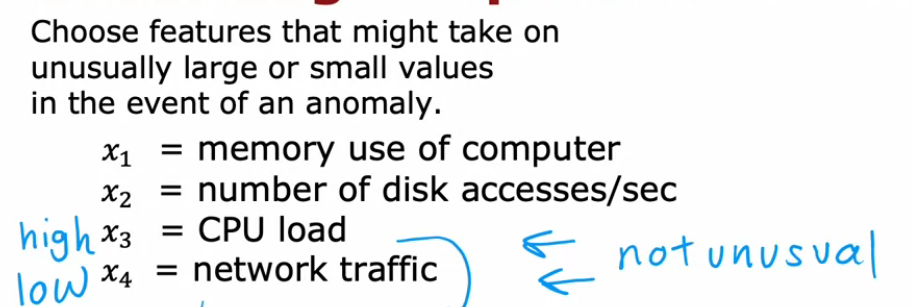

# Unsupervised learning - Anomaly detection algorithm 

***

Anomaly detection is used to detect abnormal events by learning what normal events look like. 
They can be used to detect erroneous parts, for instance, and raise flags when anomalies are detected. 

Example: Aircraft engine detection 
- We can take in m feature vectors: {vibration, heat} and plot them. 


- With this model pass in the new feature vector x and find the probability that it occurs using kernel density estimation. 
- If this is lower than some number epsilon then it is flagged as anomalous. 


***

Applications of anomaly detection: 
1. Detecting defects in manufactured goods eg: electronic parts
2. Fraud detection - Use features of a user account to check if their activity is unusual. 
3. Detection of spoilt fruits and vegetables. 
4. Healthcare industry - Mapping bodily parameters into a vector and checking if it is anomalous for the given age or sex etc. 
5. Monitoring the performance of a computer using their memory use, disk access rate, load, network traffic etc. to chefck if something is wrong with a particular computer.

***

## Using MLE for anomalous detection. 
- Assume that the features come from a normal distribution with parameters mu and sigma.
- Assume that there are n features. So we have a vector mu and sigma  of dimensions (n, 1).
- We can obtain the parameters of the normal distribution for each feature with the following: 

```mu(n) = (1/m) * sigma over i = 1 to mu of (xi sub n) ```

```sigma(n) = (1/m) * sigma  over i = 1 to mu of (xi sub n - mu) ** 2```


- Note that we find the biased variance with n degrees of freedom. 
- The likelihood of any example is the product of the likelihood of all of its features.

- p(x1) = p(x11; mu 1 and sigma 1) * p(x2; mu 2 and sigma 2) * p(x3; mu 3 and sigma 3).... p(xn; mu n and sigma n)


- p(x1) is the likelihood of x1 appearing and is calculated using the normal distribution. 

- If the likelihood is much smaller than epsilon then we flag it as an anomaly. 

***

## Evaluating an anomaly detection system 
- Just like in supervised learning models, we can evaluate anomaly detectors using multiple sets. 
- For this, we need labelled data (mostly non anomalous but some anomalous here and there). 
- We can generate 3 sets as follows: 


- Although this requires some labelled data, it is very minimally used and so is still classified as an unsupervised model. 


**ALTERNATIVE**: Not using a test set at all. 
- This is done because the number of anomalies is very low. 
- In this case, we can put all the anomalies in the cross validation set. 
- However, since we are tuning the parameters to reduce the error, reporting the cv error instead of the test error produces a biased response. 

**Evaluation metrics**: 
1. Find the true positive, false positive, true negative, false negative.
2. Put it in a confusion matrix. 
3. Find values of precision and recall 
4. Find the F1 Score 
- Using these evaluation metrics we can adjust epsilon and tune parameters in our detection model. 

***
## Supervised learning vs Anomaly detection

(a) Anomaly detection accounts for unpredictability in anomalies. 
- Eg: We might encounter an anomaly never seen before, but this will still be flagged. 
- Because we have a set of normal examples modelled using MLE. Anything beyond that will be flagged. 
- So it accounts for unpredictability and can identify it. 

_Supervised learning_ cannot do the same thing.
- We have a large number of training examples in supervised learning and it can 'learn' the types of anomalies/negative examples. 
- It uses this to predict **similar** anomalies in the future. 
- It cannot predict brand new anomalies because a logistic regression model has a fixed set of parameters that cannot adapt like anomaly detection. 

(b) Applicability of anomaly detection 
- Fraud detection 
- Manufacturing - Finding previously unseen defects 
- Monitoring computers in a data center 
- Monitoring environmental varaibles in greenhouses 

(c) Applicability of supervised learning 
- Email spam detection 
- Manufacturing - But in previously seen defects (scratches, bends)
- Weather prediction (sunny/cloudy/rainy)
- Disease classification

***
## Choosing features in anomaly detection 
- In supervised learning, including irrelevant features is not always a problem because the model can learn what features are important based on the labels. 
- In unsupervised learning, this is not the case. It can confuse the model. 

**Rules for choosing features**: 
1. Choose more or less gaussian features so that MLE is applicable. 
- You can check for the shape using matplotlib ```python plt.hist(x)```
- if the feature is not gaussian, it can be transformed:
        - Taking the natural logarithm log(x)
        - Taking the natural logarithm and shifting it by some constant
        - Taking the cube root
        - Taking the square root
- You can also use statistical tests/QQ plots to check if the data is gaussian. 

2. Error analysis
- Sometimes, it can be so that in a particular feature the anomalous examples are not well distinguised from the normal examples. 


- In this case, it is better to check for another feature where the anomaly can be distinguished from the normal examples. 

3. Creating new features like ratios of feautres 
**Example**: 


- On their own, high CPU load and low network usage are not unusual. 
- However, a high CPU load with a low network traffic is unusual. 
- So creating a feature which is the ratio of CPU load to network traffic is needed. 

***

