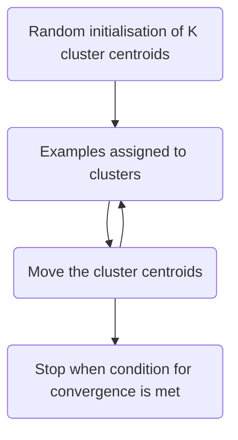
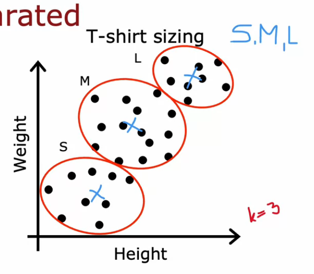
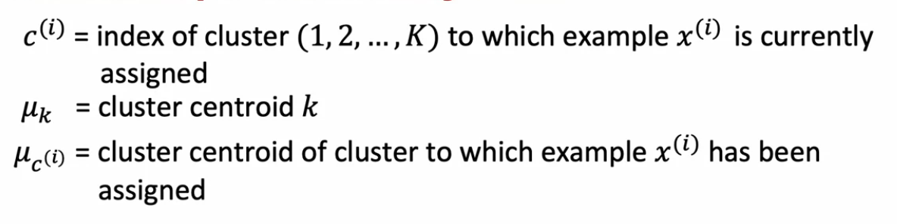
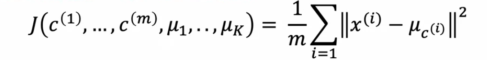
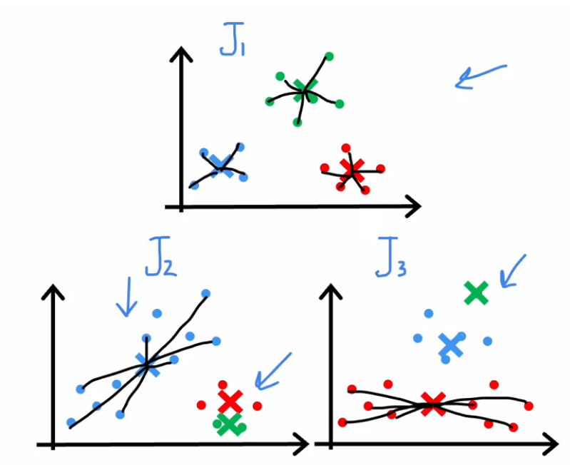
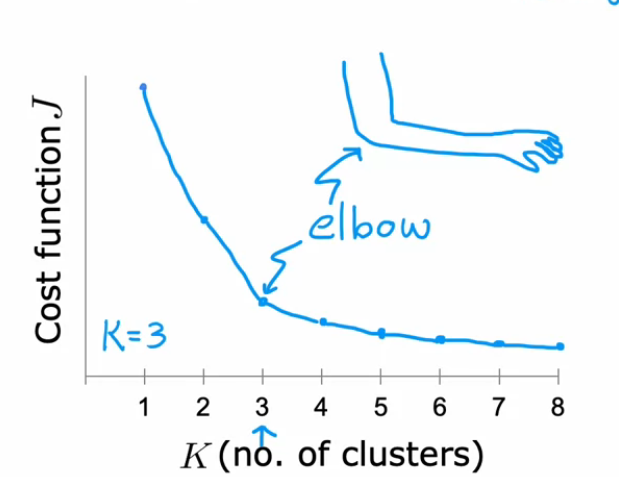
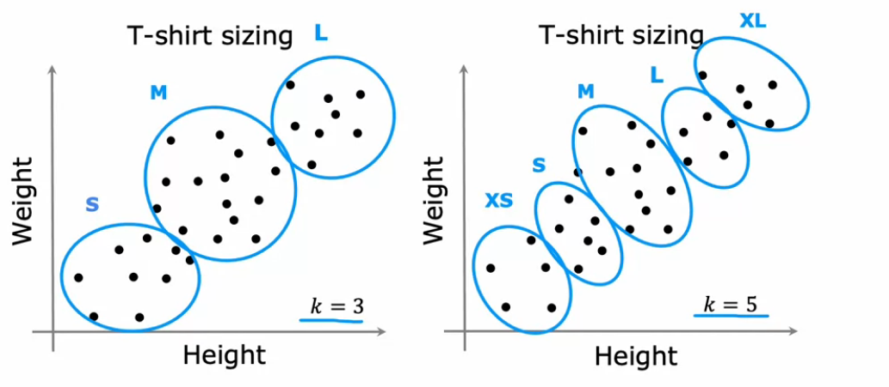

# Unsupervised learning - Clustering algorithms
***
Previously in supervised learning (binary classification), we had a ground truth label to train the model. 
In clustering, there is no ground truth. The model looks at the data and learns any patterns in the data to segment it. 

**Examples of where clustering is useful:**
1. Grouping similar news articles 
2. DNA Analysis 
3. Astronomical Data analysis 
4. Market segmentation


***
## K - Means clustering algorithm

K - means clustering involves the following steps:


### Assigning Examples to clusters

- To do this, assume that we have ```m``` examples in the set. 
- For each of the m examples, calculate the vector distance to the cluster centroid. 
- This is the L2 Norm (pythagorean) distance to the cluster centroid. 
- We associate a cluster number (from 1 to K) that has the closest distance to the given point. 


### Updating the positions of the centroids 
- Once the assignment of examples are done, the positions of each of the k cluster centroids has to be updated.
- For each of the k clusters, compute the average of the examples assigned to it. 
- Then, assign the new centre to this average.

### Convergence conditions 
- The K means algorithm stops if any of the following conditions have been met: 
1. The cluster centroids move by a very little amount (the distance between the previous and current centroid)
2. The number of points assigned to each cluster do not change.

**Sometimes, K means is used to generate centroids of datasets that are not well separated.**

- For example, in T Shirt sizing, we might use sales examples to get 3 separate cohorts: small, medium and large. 


## Optimization objective of K means algorithm 
Notation: 


For example: x10 is the 10th training example. 
c10 is the cluster centroid to which x10 is assigned. 
mu(c10) is the location of the cluster centroid to which x10 is assigned. 

**Cost function:**

J(c1, c2, ...cm, mu1, mu2....muk) = 1/m * summation over i = 0 to m: L2(xi, mu(ci))**2


L2(x, y) = Pythagorean distance between vectors x, y

### Minimising the K Means cost function 
- The cost function is also called a distortion function. 
- The steps in the K means algorithm together optimise the distortion without needing calculus. 

#### Assigning the examples to the closest cluster centroids 
- This holds the cluster centroids constant while changing the assignments c1, c2 .... cm

#### Moving the cluster centroids to the average value of the examples assigned to it.
- This holds the assignments constant while changing assignments mu1, mu2, ..... muk. 
- Together, these two will decrease the distortion WILL either decrease OR remain the same for every subsequent iteration.

***
## Initialising the K means algorithm
1. Using the training examples itself 
- Choose K < m (since you can't have more clusters than training examples)
- Choose K random training examples and set the initial centroids to those values. 

**Advantages:** Better than completely random initialisation. 
**Disadvantages:** Might incorrectly cluster by finding local minima. 

- To correct this, we can run the algorithm multiple times. We can compute the cost for all of the runs of the algorithms and pick the centroids for which the distortion is lowest. 
- Here, J1 has the smallest distortion so it will be chosen. 



```bash
for i <-- 1 to 100 {
    Run K means 100 times: 
        (a) Random initialisation
        (b) Follow steps to convergence
        (c) Compute the distortion metric and store it.
        
final = argmin(distortionarr)
}
```

***
## Choosing the number of clusters
1. Elbow method
- Plot a curve of the number of clusters against the final distortion. 
- The graph will have a protruding elbow where the distortion is lower than expected. 
- Choose this for K
- 
- But this does not work very well, and a clear elbow does not always show up. 

2. Downstream method 
- The clusters generated on K means will be used for some other process. 
- We can evaluate the performance of K means in that later process depending on the cluster. 
- Pick a middle ground where the distortion is low and the cost associated with the later process is also low. 

**Example**: T shirt sizing example 

- We can run K means on K = 3 and K = 5. Both are valid options. 
- Use this to forecast costs in T shirt manufacturing and choose a middle ground between the two. 

- K = 3 might be cheap but has a higher distortion so may not fit the customers well. 
- K = 5 might be more expensive, but it has a lower distorton so it will fit the customers better. 
- K = 4 might be a good middle ground. 

***


