# Recommender systems [Unsupervised learning]
***
- Recommender systems are a type of unsupervised learning widely used in the commerical world. 

**Terminology for recommender systems**
1. Users - The subjects from which the ratings are gathered. (n sub u denotes the number of users).
2. Items - The things that are rated by the users. (n sub m is the number of items). 
3. r(i, j) is a boolean variable indicating whether the ith item is rated by the jth user. 
4. y super (i, j) denotes the rating given to the ith item by the jth user. 

***

## Collaborative filtering
### Using Per item features 
Example: Movie rating
- Alongside the ratings for the movie, we include features of that movie in a vector.
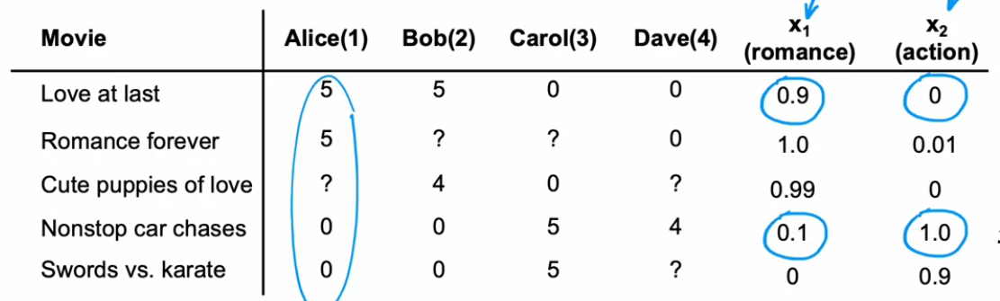

In this case, 
nu = 4
nm = 5
n = 2 (Number of features)

- We can implement a **linear regression** model to facilitate collaborative filtering: 
- MODEL: y(i, j) =  w(j) . x(i) + b(j)
- Note that j ranges from 1 to nu and i ranges from 1 to nm. 
- w(j) is a vector of shape (n, 1) and b is a scalar. These correspond to a person. 
- x(i) is a vector of shape (n, 1) and corresponds to a single movie. 

**EXAMPLE**: If we wanted alice's prediction for cute puppies of love: 
y(3, 1) = w(1) . x(3) + b(1) 

**EXAMPLE**: If we wanted Dave's prediction for swords vs karate: 
y(5, 4) = w(4) . x(5) + b(4)


### Training the model to find weights and biases
- We can train the model to optimise parameters w, b for all users (1 --> nu)
- New notation: m(j) = number of movies rated by user j. 
- To train the parameters for a **SINGLE USER**, we can use this cost: 

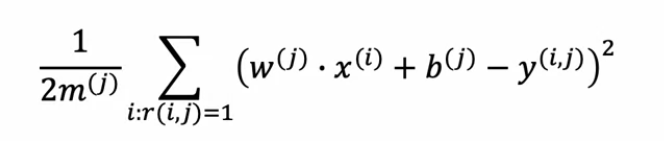
- Note the notation under the sigma. You are ITERATING OVER ALL THE MOVIES to train the USER PARAMETERS. 
- This is only done when there is a rating or r(i, j) = 1/TRUE. 
- This will minimise w(j) and b(j)
- **REGULARISED COST**
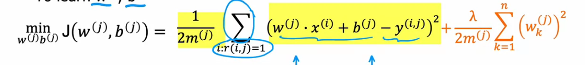
- Regularisation is applied by summing the squared of the terms in the weight vector. 
- There are n terms in the weight vector for each feature of the movie, so we go k --> 1 to n. 

### THE ABOVE WAS FOR A SINGLE USER. WE CAN LEARN THE PARAMETERS FOR ALL OF THE USERS. 
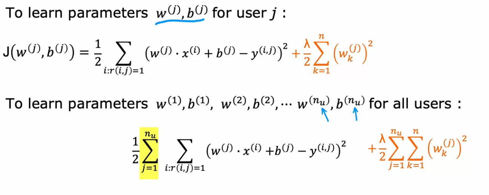

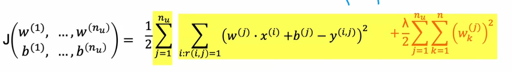
- Gradient descent or some other optimisation algorithm is used to minimise parameters. 

### Training the model to find the movie features themselves 
- Suppose we have the weights and biases for each person but do not have the movie features. 
- We can reverse engineer the training process and train an algorithm to find the features of the movie. 

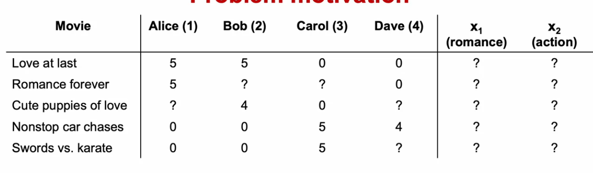

- In this case our **PREDICTION** still remains the same: 
y(i, j) = w(j) . x(i) + b(j)

- The cost function is changed to find numbers in x(i) rather than w(j) and b(j)
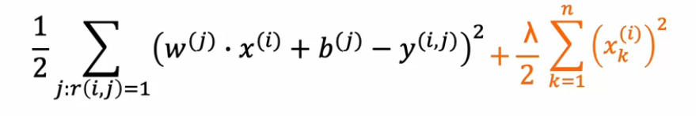
- Note that the sum is over **ALL THE USERS** in **ONE MOVIE**.
- Now we can extend this to find features for **ALL THE MOVIES**. 
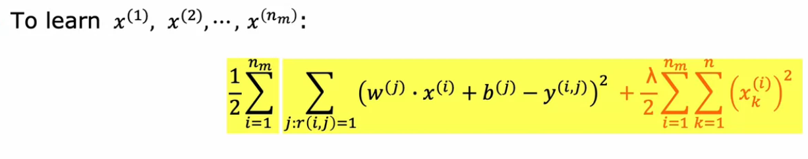
- Now, we sum over all the users for a single movie. 
- Then, we do this for all the movies. 
- This is similar to when we trained the model to find w and b for all j. 

### COMBINING THE COST FUNCTIONS
- In the previous methodology we assumed that the **features of the movie** were given and trained weights and biases. 
- in the second methodology we assumed that the **weights and biases** were given and we trained the features of the movie. 
- We can **COMBINE BOTH THE COSTS TOGETHER INTO ONE**
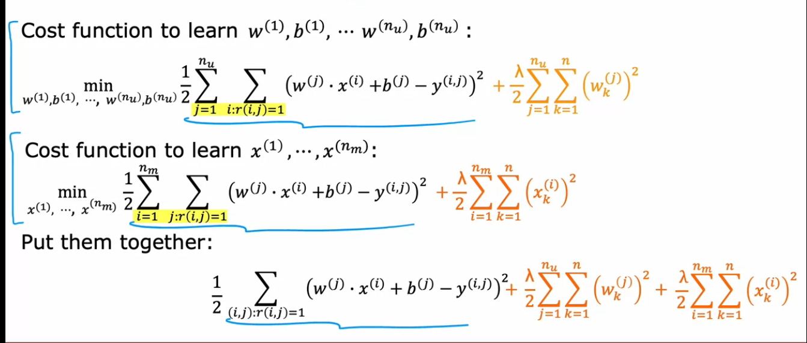
- The regularisation terms combine. 
- The previous part sums over all the movies and over all the users. 

- We can minimise the cost using **GRADIENT DESCENT**:
- 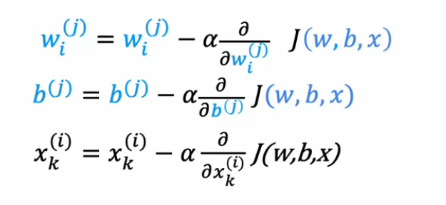

***
### Using collaborative filtering on binary labels
- When using binary labels, y(i, j) is either 0 or 1. 
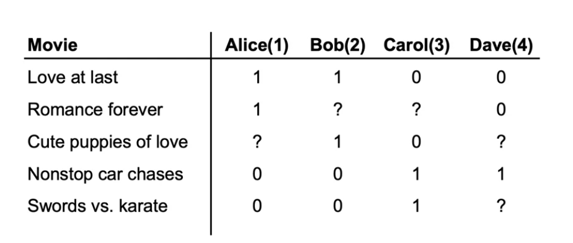
- This is similar to when we went from linear regression to logistic regression. 

**MODEL**: f(x) = g(w(j) . x(i) + b) --> where g(z) = 1/(1 + e^(-z))
If g(w(j) . x(i) + b) >= 0.5: y(i, j) = 1
If g(w(j) . x(i) + b(j)) < 0.5: y(i, j) = 1 

**THE LOSS FUNCTION** is given by the following expression - The BinaryCrossEntropy function. 
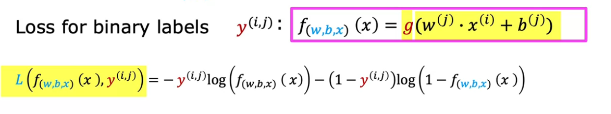

**THE COST FUNCTION**: Just like how we sum over all the pairs in squaredErrorCrossEntropy, same thing here aswell. 
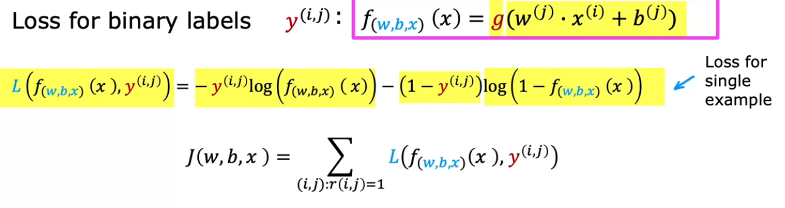

- Using this you can train the parameters w1, w2,w3, w(nu), b1 ... b(nu), x1...x(i)
- Then, we can find the probability that the jth user will click on or like the ith movie. 

***
## Mean normalisation 
- Consider the following case. user j = 5, **Eve**, has not rated any movies. 
- The values w<sup>5</sup> and b<sup>5</sup> will be set to 0 and all of eve's ratings will be 0. 
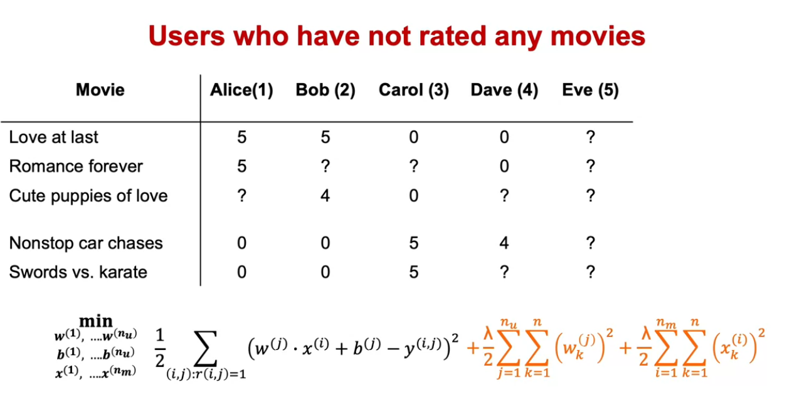
- If this was a large database anbd Eve had rated very few movies, then the values will be very close to 0. 
- To counter this, we take the mean along the rows and add it to a vector mu. mu<sub>i</sub> will be subtracted from each user for that row from the original ratings. 
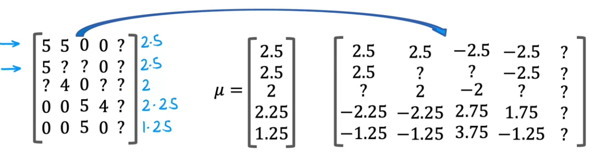
- The matrix on the right are normalised ratings. 

When we make a prediction on a nomralised rating it is very important to **add** the mean back. 

y<sup>(i, j)</sup> = w<sup>j</sup> dot x<sup>i</sup> + b<sup>j</sup> + mu<sub>i</sub>
- This way, eve's ratings will not be all zero. 
- Predidcting a new user's ratings as the mean of all other ratings is a reasonable thing to do. 
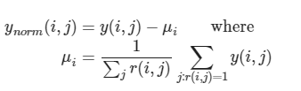
- Here, we are finding the sum of all ratings which are rated and dividing by the number of ratings m<sup>(j)</sup>
***
## Collaborative filtering in code - Using tensorflow 
- We previously used tensorflow to build neural networks for regression and classification. 
- TensorFlow can also be used to build collaborative filtering algorithms. 
- This way, it is very easy to use the cost function and there is no need to compute derivatives for ourself. 

### Automatic differentiation in TensorFlow - Custom training loop

Example: J = (wx - 1)<sup>2</sup>
```python
import tensorflow as tf 
w = tf.Variable(3.0) # Initial value of w
x = 1.0
y = 1.0 # Ground truth, target
alpha = 1e-1
iterations = 100

for iter in range(iterations):
    with tf.GradientTape() as tape: 
        fwb = w*x
        costJ = (1/2)*(fwb - y)**2
    [dJdw] = tape.gradient(costJ, [w])
        
    w.assign_add(-alpha * dJdw)
        

```

- This will train the model to optimise the values of w. 
- This is a powerful algorithm called autodiff. 

Example: Custom recommender system implementation with nm = 2 and nu = 2 and n = 2

```python
import tensorflow as tf

w = tf.Variable(tf.zeros((2, 2), dtype=tf.float64))  # Assuming (nu, n)
x = tf.Variable(tf.zeros((2, 2), dtype=tf.float64))  # Assuming (n, nm)
b = tf.Variable(tf.zeros((2, 1), dtype=tf.float64))  # Shape is (nu, nm)
y = tf.constant([[0], [0]], dtype=tf.float64) # Shape is (nu, nm)

regparam = 1e2
learningrate = 1e-3

def calculateRatings(w, x, b):
    return tf.matmul(w, x) + b

def calculateCost(w, x, b, y, regparam):
    normal_cost = 0.5 * tf.reduce_sum(tf.square(calculateRatings(w, x, b) - y))
    reg1 = 0.5 * regparam * tf.reduce_sum(tf.square(w))
    reg2 = 0.5 * regparam * tf.reduce_sum(tf.square(x))
    return normal_cost + reg1 + reg2

optimizer = tf.keras.optimizers.Adam(learning_rate=learningrate)

for iteration in range(200):
    with tf.GradientTape() as tape:
        cost_value = calculateCost(w, x, b, y, regparam)

    gradients = tape.gradient(cost_value, [w, x, b])
    optimizer.apply_gradients(zip(gradients, [w, x, b]))

    # Note that we dont need this: 
    # [dJdw, dJdx, dJdb] = tape.gradient(cost_value, [w, x, b])
    
    # w.assign_add()
    # The admam optimiser will automatically optimise values of w, x, b.

```

- How does the above code work? 
- First, w is defined such that each user occupies a row and each user will also have the same number of values as there are features in the movie. 
- Second, x is defined such that each movie occupies a column and it will have as many elements as features. 
- When you do tf.matmul(w, x) it produces a tensor of dimensions (nu, nm) so ratings of each user along a row one entry per movie. 
- Then we add the bias, one for each user in one row. It is broadcast to add to all the movie ratings. 
- Then in calculateCost we subtract the y values from the predictions and square the entire result. 
- Then we sum it which is equivalent to summing over all pairs in the summation formula. 
- We also add the regularisation terms for the w and x vectors.
- Then the adam optimiser is initialised and a tape is applied to the cost function. 
- The optimiser will automatically update the values of the variables. 

***

## Finding related items using feature vectors
- Related items can be found using the distance between the feature vectors, written as: 

r = sigma(l = 1 to n) (x<sub>l</sub><sup>(k)</sup> - x<sub>l</sub><sup>(i)</sup>)<sup>2</sup>

= ||x<sup>(k)</sup> - x<sup>(i)</sup>||<sup>2</sup> (the L2 norm distance between the two feature vectors)

***
### Limitations of collaborative filtering algorithms 

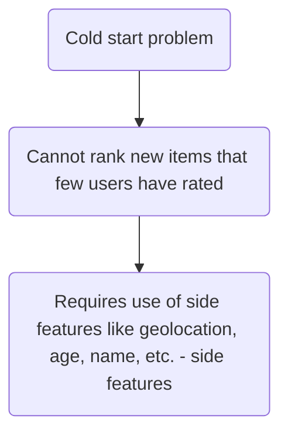
- The cold start problem is justified by using content based filtering algorithms. 
- They are used throughout the industry. 

***
# **Content based filtering**

- **Collaborative filtering** recommends items based on ratings of all the other users who gave similar ratings as you. 
- **Content based filtering** recommends items based on featurs of user and item to find a good match. 

### Terminology related to content based filtering 

- (a) j - iterator variable for the user
- (b) i - iterator variable for the item 
- r(i, j) - rating status (1 for yes, 0 for no)
- y<sup>(i, j)</sup> - rating given by user j for item i 
- nu and nm as usual - number of users and items respectively. 

## Constructing feature vectors for users and movies
- For content based filtering, we need to construct a< user vector x<sub>u</sub><sup>(i)</sup>
- We also need a movie vector - x<sub>m</sub><sup>(j)</sup>
- We might use one hot encoding for features like country to get boolean variables.

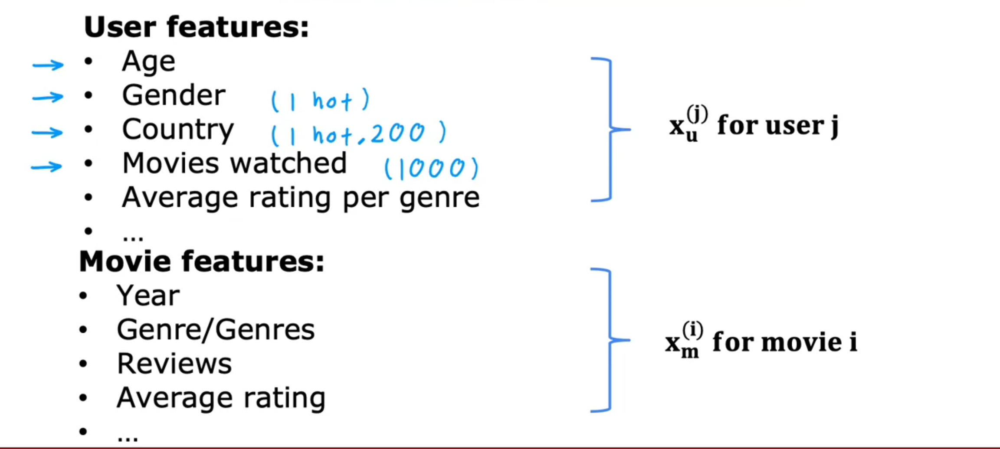

- Note that the user vector and the movie vector are not of the same size. For example, the user vector might have 200 numbers while the movie vector might have 50 numbers only. 

***
## **Collaborative filtering algorithm**
- The model used in collaborative filtering was f(x) = w<sup>(j)</sup> * x<sup>(i)</sup> + b<sup>(j)</sup>
- For content based filtering, we use: f(x) = v<sup>(j)</sup><sub>u</sub> * v<sup>(i)</sup><sub>m</sub>
- There is no bias term. 

**Very important**: V<sub>(u) and V<sub>(m)</sub> are derived from x<sub>u</sub><sup>(i)</sup> and x<sub>m</sub><sup>(j)</sup> respectively. 
- These **HAVE** to be the same size to be able to predict the dot product.
- The features are corresponding. Eg: in V<sub>(u)</sub> the first number might be affinity to romance, and in V<sub>(m)</sub> the first number will be how much romance is there in the movie. 

### Computing the vectors V<sub>(u) and V<sub>(m)</sub> from x<sub>u</sub><sup>(i)</sup> and x<sub>m</sub><sup>(j)</sup>

#### We can devise 2 separate neural networks to compute the vectors using in the calculation of y<sup>(i, j)</sup>. 
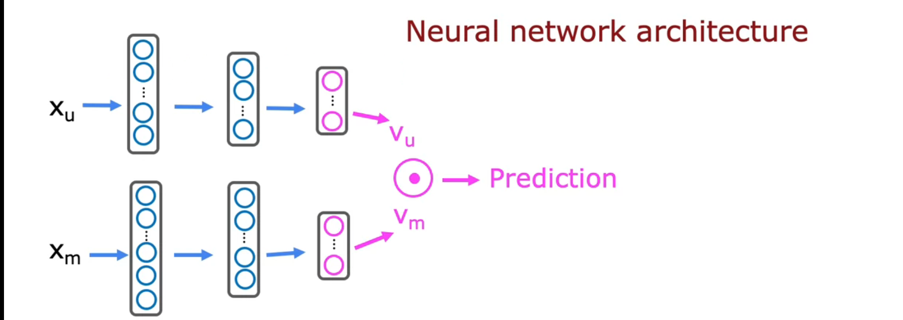
- The top network is a **user network** that computes V<sub>(u)</sub>. The dimensions are (1, k) where k is the number of output layers. 
- The bottom is a **movie network** that computes V<sub>(m)</sub>. The dimensions are (1, k) as well where k is the output varaible. 

### Training the neural network
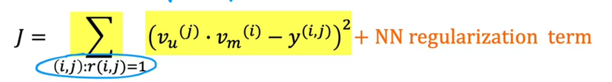
- The error is the discrepancy within the dot product and y<sup>(i, j)</sup>. 
- We can square it and sum over all the examples to get the cost. 
- We can then use gradient descent to optimise. 

### Application: Recommending similar items from trained parameters. 
- Recall that in colaborative filtering we used the learned movie feature vectors and computed the vector distance between them as the similarity between any two movies. 
- We can do that here as well: 

Similarity(k, i) = ||V<sub>m</sub><sup>i</sup> - V<sub>m</sub><sup>k</sup>||<sup>2</sup>
This is the **Vector distance**. It indicates similarity between movie k and movie i. 

- if ||V<sub>m</sub><sup>i</sup> - V<sub>m</sub><sup>k</sup>||<sup>2</sup> <= α then we can recommend this as a similar movie. 

### Scaling the content based filtering algorithm to a large catalogue

- It becomes expensive to run the neural network through thousands or millions of items to make forward propogation inference to predict the rating. 
- We can use **retrieval and ranking** to deal with this. 

1) Retrieval - Generate a large list of plausible item candidates 
    - Randomly sample movies from the most viewed genres 
    - Top 20 movies in the country (using IP geolocation)
    - For each of the last 10 movies viewed by the user, find 10 most similar movies. 
    - Compile this into a list and eliminate duplicates/those already purchased. 
2) Ranking
    - Use the learned neural network to rank the movies out of those retrieved. 
    - Display ranked items to the user. 

### Ethical considerations of recommender systems 
- To make the world better, we must use machine learning ethically and improve quality of life. 
- There are use cases which are, unfortunately, vicious and only profit maximising and not very constructive for the user. 


- The one on the left is ethical and good for the user. 
- The one on the right is not ethical and only aims to make profits. 
- Recommender systems that maximise user engagement lead to aplification of hate, toxicity and conspiracy. 
      - Easy said, but a possible solution would be to filter out content that spurs conspiracy.

***

## Implementing content based filtering on tensorFlow

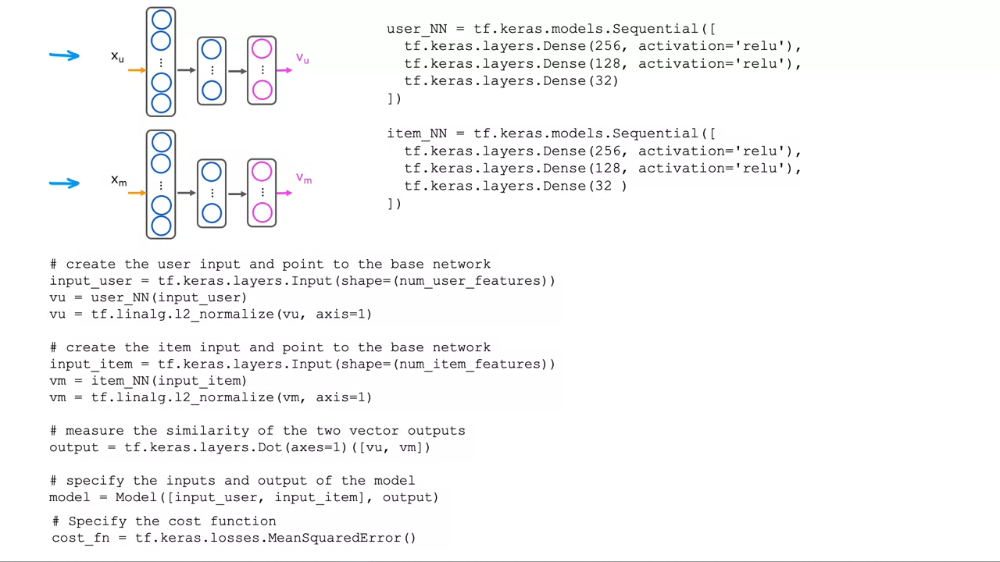

***
- Notice the use of a new layer type - ```tf.keras.layers.Dot(axis  1`([vu, vm])```

---

# Principal component analysis 