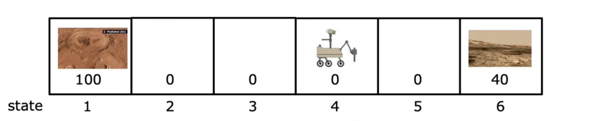

# Reinforcement learning
***
Reinforcement learning is very useful although not widely used in commercial applications. 

### Basic principle of reinforcement learning 


For example: how to control the movement of an autonomous helicopter using machine learning? 
- If you suspect that supervised learning might work, but what would the ground truth labels be? 
- We cannot obtain the "correct" position and hence we resort to unsupervised learning.

- Reward function:
    - When the helicopter flies incorrectly, punish it. 
    - When the helicopter flies correctly, reward it. 
    - Just like training your pet dog!
  
Other examples: 
1. Playing video games 
2. Factory optimisation
3. Stock trading 
4. Controlling robots

---

## Reinforcement learning formalism (Markov decision process, MDP)
- A robot might go through a sequence of steps (states) and carry out certain actions to move through to a different state. 
- Example: mars rover


State 1 is rewarding because it is good to conduct science there. 
State 6 is also rewarding for the same reason, albeit not as much as state 1.

- When the robot is at state 4, it might choose to move right and go to state 5, get a reward of zero, to state 6 and then get a reward of 40. 
- It might also move the other way until it gets to state 1 and gets a reward of 100. 
- These are called the **terminal** states and the algorithm stops there. 

### Return in reinforcement learning 
- The discount factor, gamma γ is used to make the algorithm impatient. 
- For example the rover might start at 2. It can get to state 1 quicker, but nothing is stopping it from going to state 6. 
- The discount factor is introduced to take in the time constraint. 

γ is usually close to 1. Eg: γ = 0.92. 
- If gamma is **SMALLER** the rewards are more undervalues and the algorithm is more impatient. 
- This is because you are getting a smaller and smaller fraction of the reward. 


Return = R1 + R2(γ) + R3(γ)<sup>2</sup> + R4(γ)<sup>3</sup> + .... until terminal state. 

OR

Return = Sum (from i = 1 to terminal) [R<sub>i</sub>(γ)<sup>i-1</sup>]

**Example**: if the robot moves left all the time, what is the return from starting at different initial states? 

**Example**: if the robot moves right all the time, what is the return from starting at different initial states? 


- The actions you take influence the RETURN overall. 
- The discount factor penalises the system on time and incentivises it to get to the positive reward as quick as possible. 
- it therefore will incentivise the system to push out negative rewards as far out as possible with respect to time. 
---
## Policy function in reinforcement learning 
- The policy function denoted π tells you what action a = π(s) to take in every state (s) to maximise the return. 
- It looks at the return till terminal state on all possible actions and chooses the action with the maximum return. 


---
## Algorithm for reinforcement learning (State action value functions)
- The state action value function is denoted Q. It is a function of the state S and action A and measures the following. 
- Q(s, a) = Return **IF you start in state s, take action a once, and then behave optimally after that to maximise return.**
- There is a way of computing Q(s, a) even before optimal choices have been decided. 

**Example**: Mars rover
Q(2, -->): First go to state 3. The most optimal action is to go left to state 1 which produces a return of 12.5. 
Q(2, <--): First go to state 1. The most optimal action is to go left to state 1 which produces a return of 50. 
Q(4, <--): First go to state 3. The most optimal action is to go to state 1 which produces a return of 12.5 again. 


- Q(s, a) can be produced for every possible pair of state and action.
- This is also called the Q function. 
- The best possible return from state s is argmax(Q(s, a));; maximising over a. 
- That is the highest return you can get from a state s by taking some action a. 

Using the Q function, we can calculate pi(s). 
- At a given state s, pi(s) = argmax(Q(s, a), over a). 
- This gives us the maximum return after one of the actions a, and thus denotes the policy function a. 
---
## Bellman's equation 
Notations: 
1. s - Current state
2. a - current action from current state 
3. s' - state you get to from s after action a 
4. a' - action you take in state s' 
5. R(s) - Reward of state s 

**Q(s, a) = R(s) + gamma * max(Q(s', a') over all a')**

At terminal state: Q(s, a) = R(s)


### Intuition of bellman's equation: 
R(s) - the immediate reward at state s. 

gamma * max(Q(s', a') over all a') - the return from behaving optimally after the first action. 

### Stochastic environments 
- Usually, the model takes the correct step as obtained from the policy function, however, it can sometimes take a mis step because of a hardware difficulty. 
- With this situation, the state value function and bell's equation becomes probabilistic, with the probability of taking the opposite action called a **mis-step probability**.
- We also transform **gamma * max(Q(s', a') over all a')** into **gamma * E[max(Q(s', a') over all a')]**

- The probability distribution is modelled in this way: 
Event: Taking the correct step; probability: Correct probability 
Event: Taking a mis step; probability: mis step probability 


- Thus introducing this new random aspect changes the state value function and bellman's equation.

---
## Continuous state spaces
- In the previous examples, the state space was discrete. It was a list from 1 to 6.
- In the case of continuous state spaces, the state space is a continuous function, a number line.

Example: Autonomous helicopter 

**The state of the helicopter will include**: 
1. x - Displacement along x axis from the controller
2. y - Displacement along y axis from the controller
3. z - Displacement along z axis from the controller
4. Yaw - Compass orientation
5. Pitch - Tilt of the helicopter
6. Roll - Roll of the helicopter
7. x_dot - Velocity along x axis
8. y_dot - Velocity along y axis
9. z_dot - Velocity along z axis
10. Yaw_dot - Angular velocity along yaw axis
11. Pitch_dot - Angular velocity along pitch axis
12. Roll_dot - Angular velocity along roll axis
etc. 
Therefore, we can consturct a vector of values which all take a continuous value, something like this.


Example: Lunar Lander 

**The action space of the MDP for the lunar lander include**: 
1. Main engine thrust
2. Left engine thrust
3. Right engine thrust
4. Do nothing

**The state space of the MDP for the lunar lander is a vector that includes**:
1. x - Displacement along x axis from the target spot
2. y - Displacement along y axis from the target spot
3. x_dot - Velocity along x axis
4. y_dot - Velocity along y axis
5. Angle - Angle of the lander
6. Angle_dot - Angular velocity of the lander
7. Left leg contact (binary valued function)
8. Right leg contact (binary valued function)

- The reward functions address different actions of the state space to dictate actions from certain states as follows: 


---
### Learning the state action value function for continuous state spaces
- We can train a neural network that will input the _current state_, _current action_, and _next state_ and output the _state action value function_.
- The neural network will be trained using the bellman's equation.

#### Neural network architecture 
- We will produce an input vector x from the following:
  - Current state s - all of the features in a column
  - Current action a - all of the actions in **ONE HOT** encoding. 
  - Example: If the current action is action 1 (main thurst)


### Using the bellman equation to train the neural network 
- Although reinforcement learning is different from supervised learning, we will generate output labels for thousands of random state action pairs. 
- The feature is the **state action pair**, a vector of the 8 states and the 4 actions in one hot form. 
- The target variable is the **state action value function**.

Experimenting with the lander: 
- We can take random actions with the lunar lander, which will generate tuples of size 4. 


- The superscript i indicates the _experiment number_. 
- Suppose you are randomly taking 10000 actions. Then i will range from 0 to 9999 and you will have 10000 tuples for creating the training set. 
- The neural network will be trained on these tuples.

X<sup>i</sup> = (s<sup>i</sup>, a<sup>i</sup>)

Y<sup>i</sup> = R(s<sup>i</sup>) + gamma * max(Q(s<sup>i+1</sup>, a<sup>i+1</sup>))

- The pair x1, y1 becomes the first training example. 
- **NOTE:** We don't know what the Q function is in the computation of Y, but it turns out that we can take a _random guess_ for Q and it will still work. 


### Summary of the algorithm
1. Initialise the neural network with random weights as a guess of Q(s, a)
2. Repeat until convergence {

   1.Collect a set of tuples (s, a, s') by taking random actions in the environment
  
   2.Compute Y<sup>i</sup> = R(s<sup>i</sup>) + gamma * max(Q(s<sup>i+1</sup>, a<sup>i+1</sup>))

   3.Perform a gradient descent step on (Y<sup>i</sup> - Q(s<sup>i</sup>, a<sup>i</sup>))<sup>2</sup> with respect to the weights of the neural network
}
3. We will save the 10,000 most recent tuples - This is called a **REPLAY BUFFER**
4. Create a training set as described above. 
5. use mode.fit() to train the neural network.
6. Now we can use the neural network to predict the Q function for any state action pair. 

- This is called the Deep Q Network (DQN) algorithm.

### Improved neural network architecture 
- The neural network architecture described above is not very good as we have to carry out forward proporgation for all possible actions for every single state. 
- We can train a single neural network to output all possible Q values for all actions for a given state. 
- This is done by modifying the output layer of the neural network to include the same number of neurons as your number of actions from any state. 
- In the case of our lunar lander, this is what the architecture looks like: 


---
### Epsilon greedy policy 
- How do we pick actions while still learning the Q functions? We don't know what is the best action to take at each state. 
- We can use the epsilon greedy policy to pick actions.

How does it work? 
- We will pick a random action with probability epsilon.
- We will pick the best action with probability 1 - epsilon.

- This is because, we must explore all possible actions. The random initialisation might result in a particular action ALWAYS returning a low Q output.
  - The neural network will never learn that this action is actually a good action, and so to overcome that preconcieved notion, we take actions at random with probability epsilon.
  - This is called the **exploration** phase.
  - The neural network will learn that this action is actually a good action, and so to exploit that knowledge, we take the best action with probability 1 - epsilon.
  - This is called the **exploitation** phase.

- The value of epsilon is usually 0.1 or 0.2.
- As the neural network learns, we can reduce the value of epsilon to 0.01 or 0.02 as the neural network would overcome notions slowly and would not need to take random actions as often.
- This is called **decaying epsilon**.
- We can also use a **fixed epsilon** value, but this is not recommended.

### Hyperparameter tuning
- In normal supervised learning, if hyperparameters like the learning rate and the regularisation parameter are not tuned properly, the neural network might take 2 or 3 times as long to train. 
- In reinforcement learning, if the hyperparameters are not tuned properly, the neural network might not learn at all or will take much longer. 
- It is very important to tune the hyperparameters properly in reinforcement learning as it can cost much more to run a badly tuned algorithm. 


---
## Further refinements to DQM
### Minibatch training

- While performing gradient descent, we have to compute the cost again and again. 
- When we have a lot of training examples, this turns out to be very slow. 


- Instead, for calculating the partial derivatives, we can pick some m' number of examples (a subset of the training set) for faster training. 
- Different subsets are looked at every subset of the algorithm, as follows: 


- Although the gradient descent algorithm is not as reliable, it is much less computationally expensive.
- We can use mini batch with other optimisation algorithms like the adaptive moment. 

### Soft updates
- Recall that in DQM, we are setting a new Q function to replace the previous Q function. 
- There might be a sudden change in the Q function which might cause the algorithm to diverge and not converge again. 
- To prevent this, we can use a soft update.

NORMAL UPDATES
```Normal updates: 
W = Wnew
B = Bnew
```

SOFT UPDATES
```Soft updates:
W = tau * Wnew + (1 - tau) * W
B = tau * Bnew + (1 - tau) * B
```
Tau is another hyperparameter which controls how agressively Qnew replaces Q. 
- Tau is usually set to 0.001 or 0.01.

---

## Conclusion 
Limitations of reinforcement learning:
1. Lots of research applications use these algorithms in simulations - It is much harder to work a robot, say, in the real world with reinforcement rather than in a simulation. 
2. There are very few applications of reinforcement learning in the real world compared to unsupervised and supervised learnings. 

However, there is a lot of exciting research on reinforcement learning and it has a lot of potential in future applications.

---
